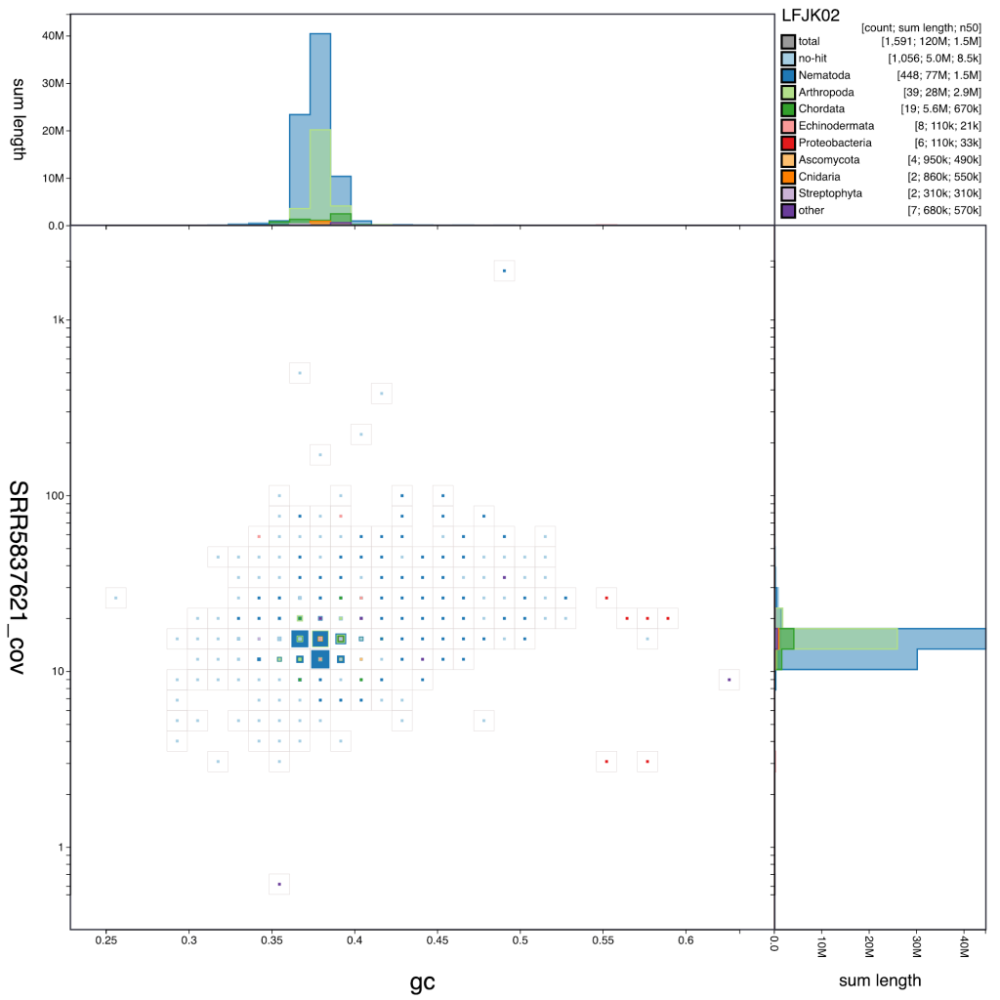
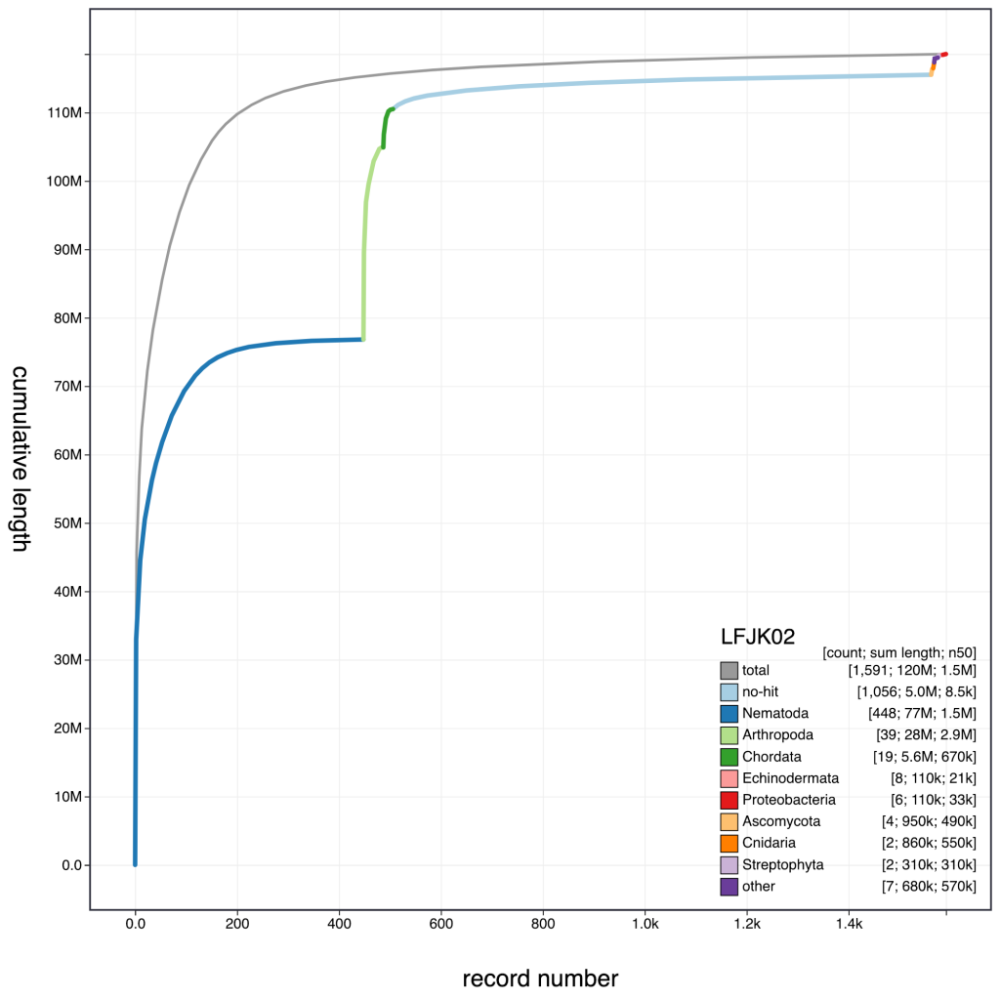
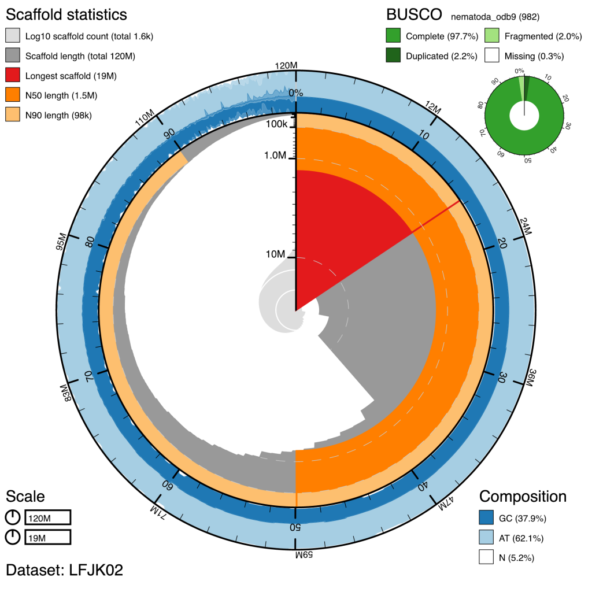
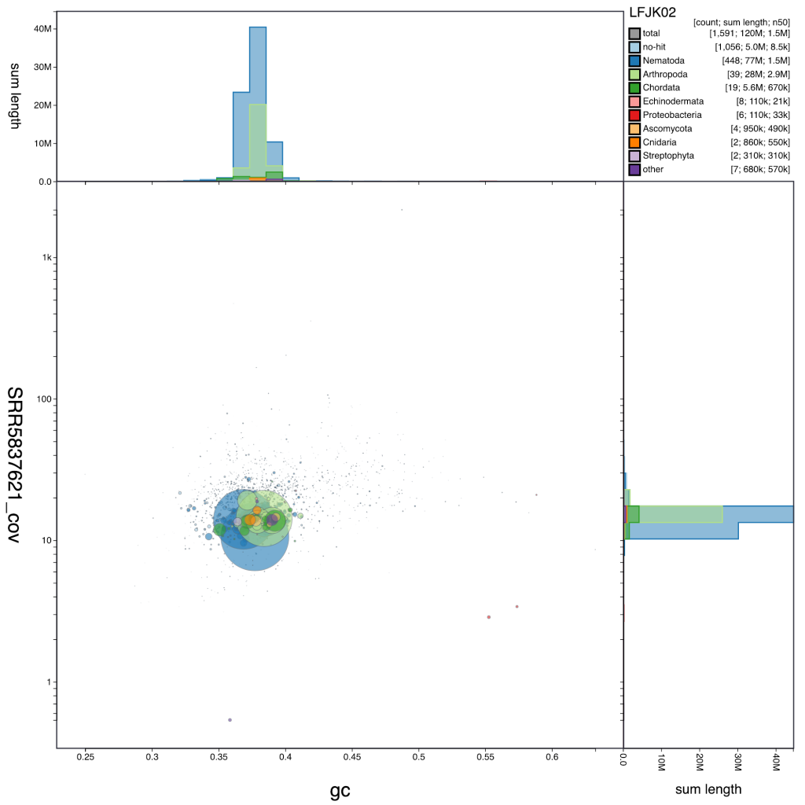

BlobToolKit is a set of tools to allow interactive exploration, assessment and filtering of genomic datasets. The main tools are BlobTools2, a re-implementation of BobTools to support additional features and The BlobToolKit Viewer, which allows interactive exploration of datasets.

This series of blog posts aims to introduce many of the features in BlobToolKit and provide a set of examples to help you get started with your own data.  Further documentation is available on the BlobToolKit GitHub pages: [BlobTools2](https://github.com/blobtoolkit/blobtools2) and [BlobToolKit Viewer](https://github.com/blobtoolkit/viewer).

1. [Getting Started with BlobTools2](https://blobtoolkit.genomehubs.org/?p=133)
2. Interactive blobology (coming soon)

Example plots generated by the BlobToolKit Viewer:

- 
    
- 
    
- 
    
- 
