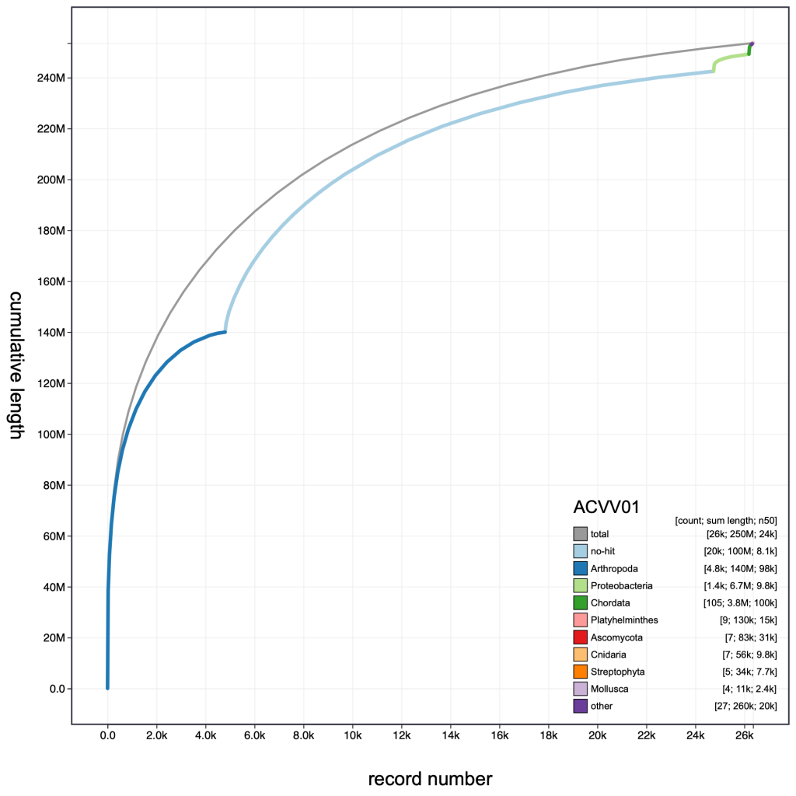
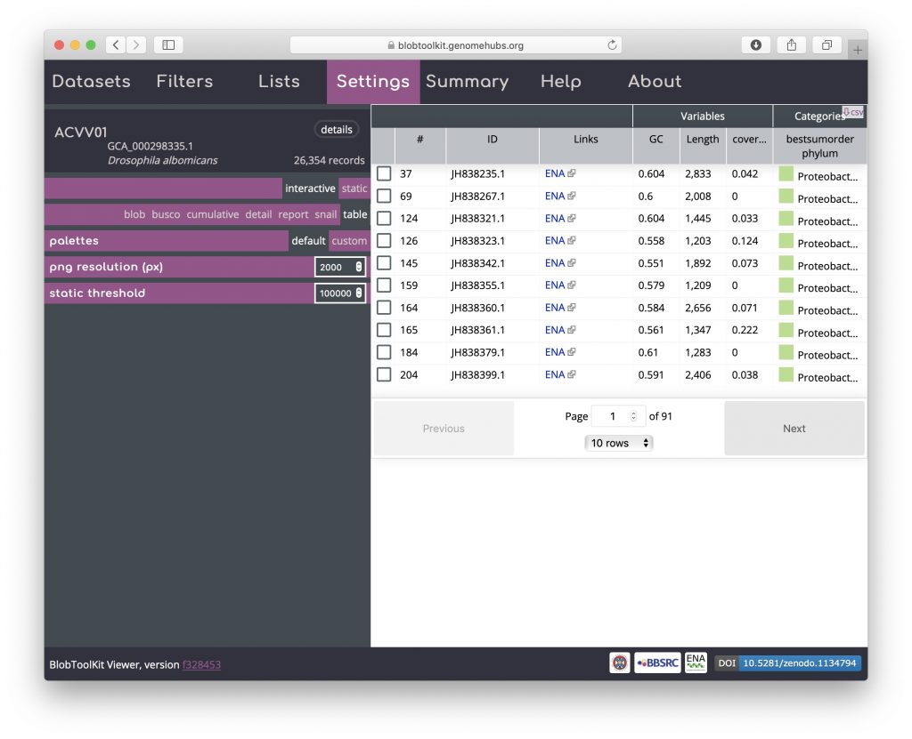

The BlobToolKit Viewer allows interactive exploration of [BlobDir](https://blobtoolkit.genomehubs.org/specification/) datasets produced by [BlobTools2](https://blobtoolkit.genomehubs.org/blobtools2/) to aid in the identification and filtering of contaminants and other cobionts as part of the assembly QC process.

The viewer allows reproducible interactive data exploration across a suite of customisable views:

- 
    
    hex-binned blob plot
    
- 
    
    circle blob plot
    
- 
    
    stacked cumulative distribution
    
- 
    
    snail plot
    
- 
    
    interactive selections
    
- 
    
    highly configurable
    
- 
    
    tabular views
    
- 
    
    query using BUSCO sets
    

The Viewer can be run locally to view datasets processed using [BlobTools2](https://blobtoolkit.genomehubs.org/blobtools2/), or visit our [public Viewer instance](https://blobtoolkit.genomehubs.org/view) to browse analyses of over 2,000 publicly available, [INSDC](http://www.insdc.org/)\-registered datasets:

Browse our list of [Tutorials](https://blobtoolkit.genomehubs.org/btk-viewer/viewer-tutorials/) to learn how to use the Viewer then visit our public instance at [blobtoolkit.genomehubs.org/view](https://blobtoolkit.genomehubs.org/view) or check out our [open-source code](https://github.com/blobtoolkit/viewer) on GitHub to start using it on your own datasets.
