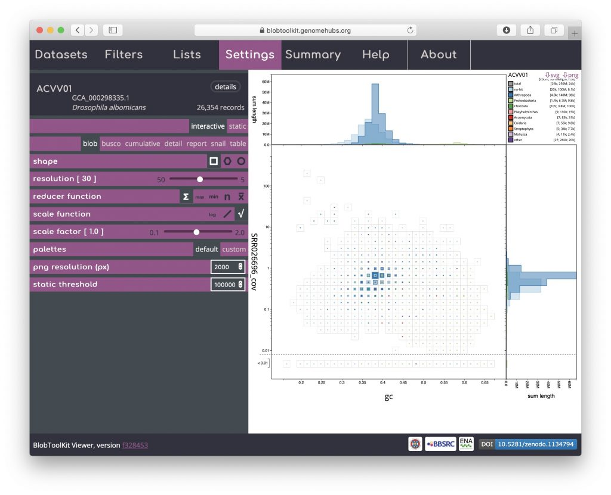
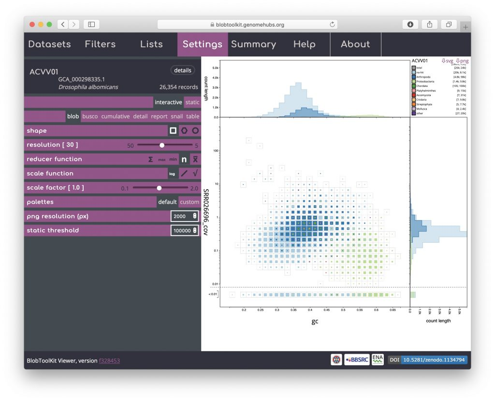
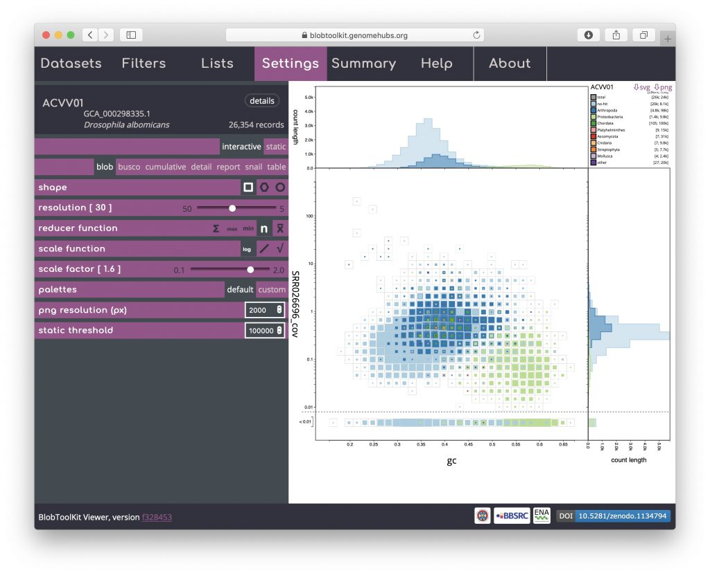
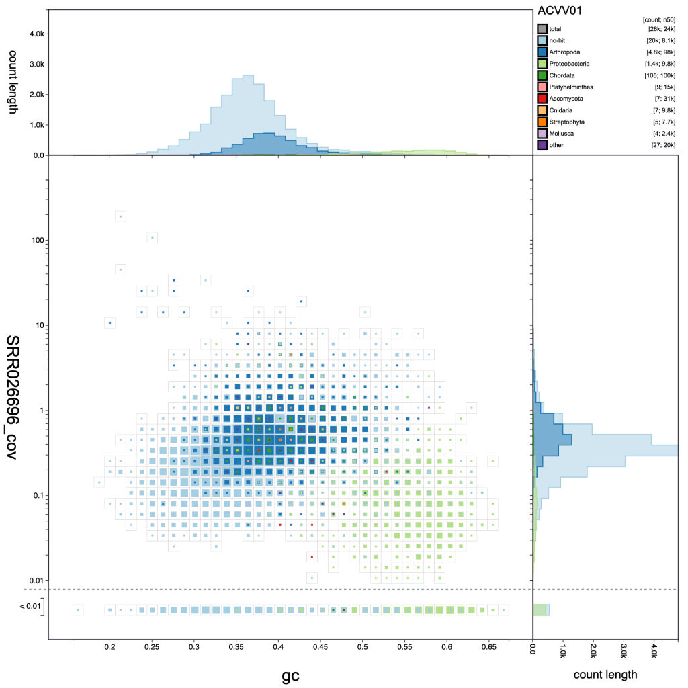
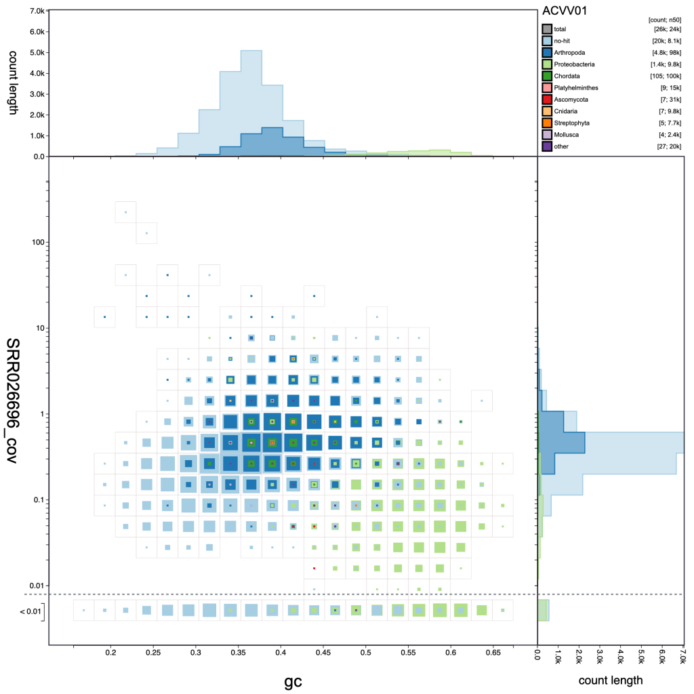
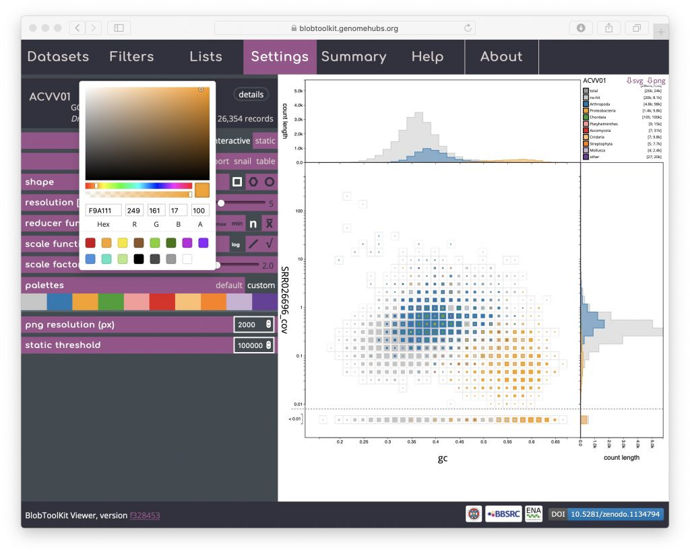
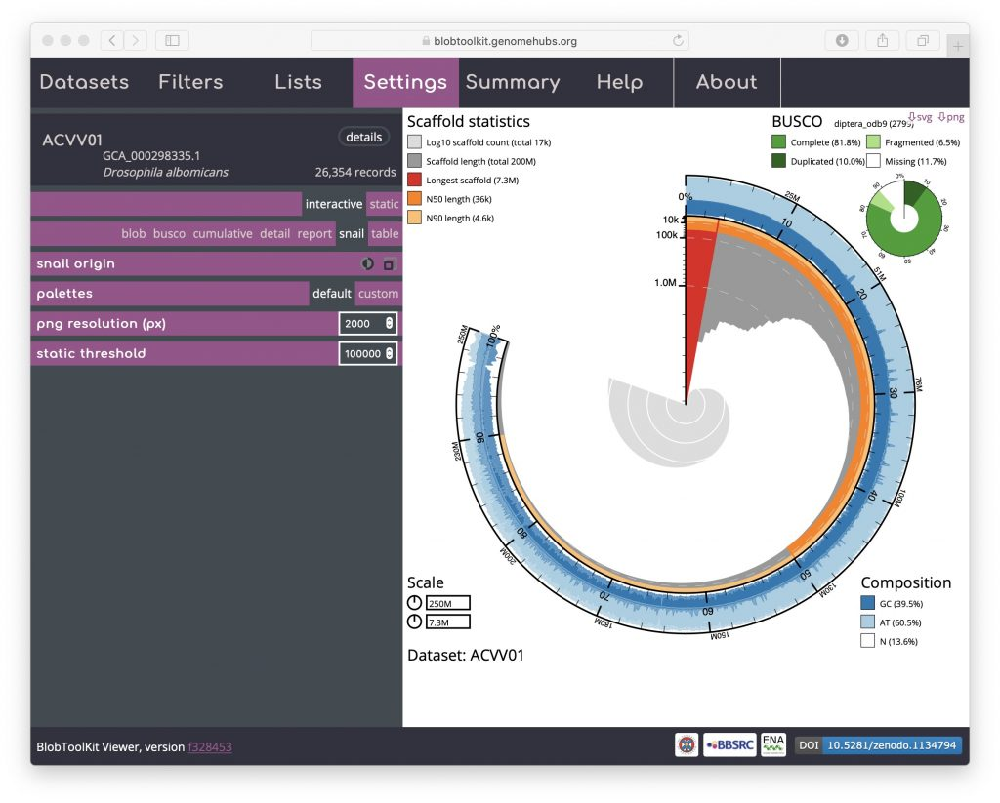
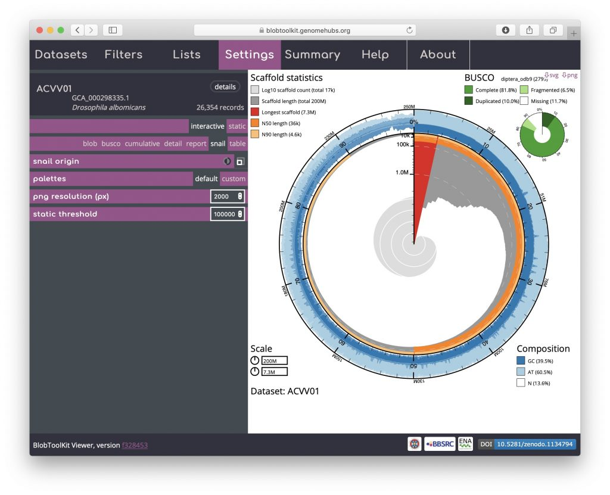

For each plot type, a number of settings can be adjusted, either to manipulate the plot to help explore specific features or to modify the appearance to generate a publication-ready image to export. Some of these settings are shared across plot types, while others are plot-specific.

Plot settings can be accessed by opening the _Settings_ menu. Blob plot specific settings include **_shape_**, **_resolution_**, **_reducer function_**, **_scale function_** and **_scale factor_**:

Use of the **_plot shape_** parameter is discussed in _[Exploring views](https://blobtoolkit.genomehubs.org/btk-viewer/viewer-tutorials/exploring-views/)_.

The _**reducer function**_ determines how the values (sequence lengths) for each category in each bin are combined to produce the single value that is scaled in the binned plots. The default is to _sum_ all the values, but alternative functions use the _minimum_ value, the _maximum_ value, the _count_ (number of sequences) or the _mean_ of all values. The _**scale function**_ determines how these values are scaled and applies to both binned an non-binned (circle) blob plots. The default is _square-root_ so the area is proportional to the value, while alternative _log_ and _linear_ scale functions increase or decrease the prominence of small values, respectively. Setting the _**reducer function**_ to _count_ and the scale function to _log_ scales highlights the number of scaffolds in each bin:

Here it is clear that the light blue and dark blue areas of the plot overlap, while there is a distinct area coloured light green. Dark blue represents Arthropoda and, given that this dataset is based on a _Drosophila albomicans_ assembly is likely to originate from the target organism. Light blue represents scaffolds with no sequence-similarity hits to taxonomically annotated sequences in the public databases. Given the overlap, this is likely to mostly reflect _Drosophila albomicans_ scaffolds that were too short to have hits in the databases, or _Drosophila_\-specific sequences as _Drosophila_ sequences were masked when running the BLAST searches. In some cases the presence of a distinct blob in addition to the target organism would reflect contamination. Here the light green represents Proteobacteria so this region of the plot is likely to reflect a _Wolbachia_ endosymbiont.

Changing remaining parameters can be useful for identifying features, though for this example dataset may not be necessary. Increasing the _**scale factor**_ can make the regions in the plot more "blobby" by setting the maximum size of a square to be greater than the bin-size, allowing adjacent bins to overlap:

Adjusting the _**resolution**_ changes how many bins the _x_\- and _y_\-axes are divided into. Increasing the _**resolution**_ may help to see the division between overlapping blobs or to identify bimodal distributions associated with heterozygosity. Reducing the _**resolution**_ masks fine-scale patterns but makes selection of plot regions easier (see _Using selections_):

- 
    
    resolution: 40
    
- 
    
    resolution: 30
    
- 
    
    resolution: 20
    

Palettes are shared across multiple plot types. The default is based on a Colorbrewer palette. Colours can be changed by selecting the "custom" value for the _**palettes**_ parameter then clicking on coloured swatches to adjust the colours assigned to each category:

If adjusting the palette to produce an image for publication or on a poster, note that you are able to set the resolution of exported PNG format files by setting the _**png resolution (px)**_ parameter to the width of image you wish to export.

The _**static threshold**_ parameter is used to set the maximum size of dataset that will be displayed interactively. With the default setting, pre-rendered, static images will be displayed in place of the interactive views for datasets with more than 100,000 scaffolds to accommodate users visiting the site with relatively low-powered devices. To view large datasets interactively, either increase this value or click the "interactive" button at the top of the _SettingsI menu_ (see _Viewing large datasets_).

An additional option that is available for both the cumulative and snail plots it the option to scale the plot to the current filtered dataset (see _Filtering assemblies_). This is presented as an icon under the _**curve origin**_ or _**snail origin**_ parameters and adjusts the maximum axis values to match the values for the filtered dataset rather than the complete dataset. This can make the plots easier to interpret, particularly if a large proportion of the assembly has been filtered out. For a _snail_ plot of a filtered dataset:

Toggling the _**snail origin**_ _scale_ icon ensures that the plot reflects the filtered dataset:

