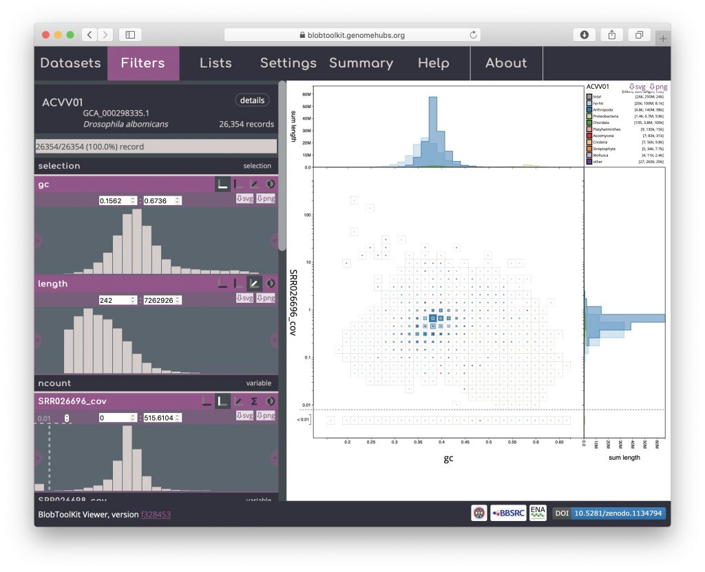
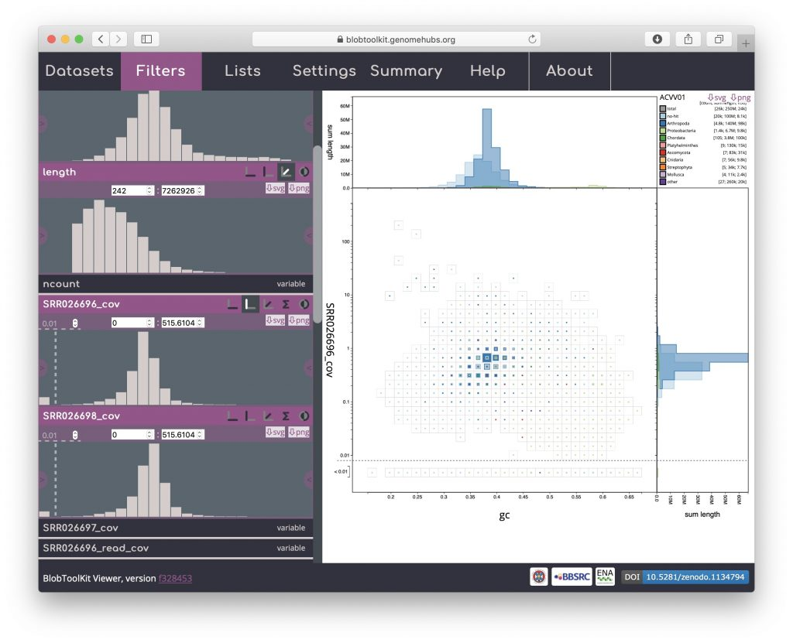
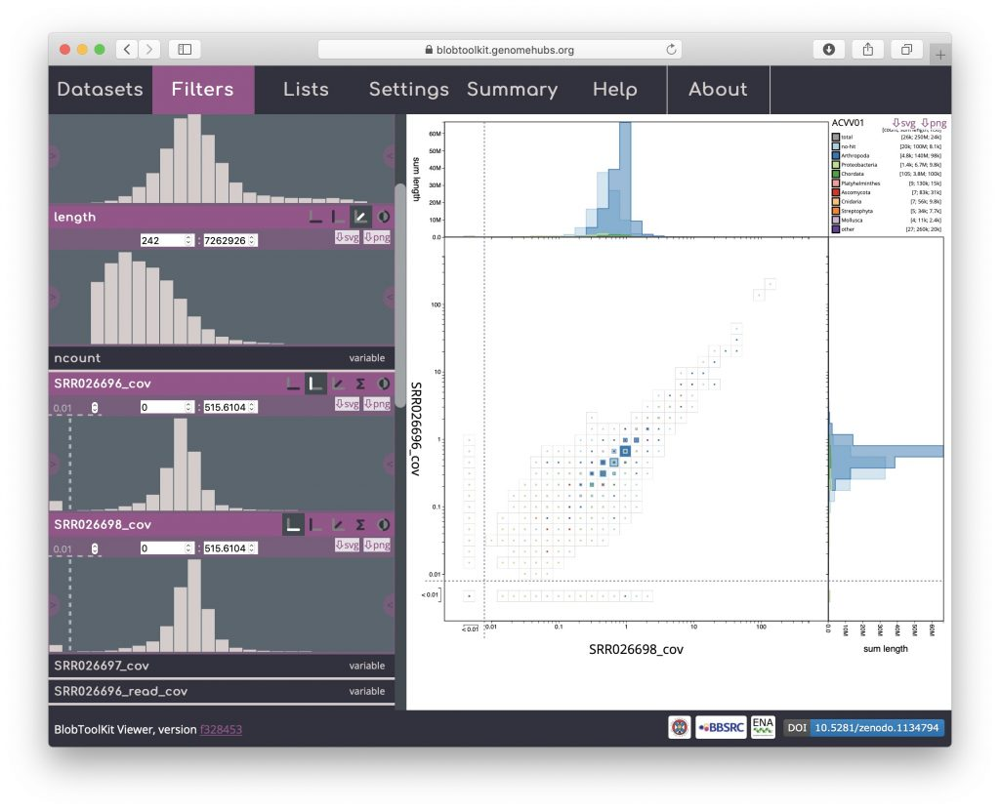
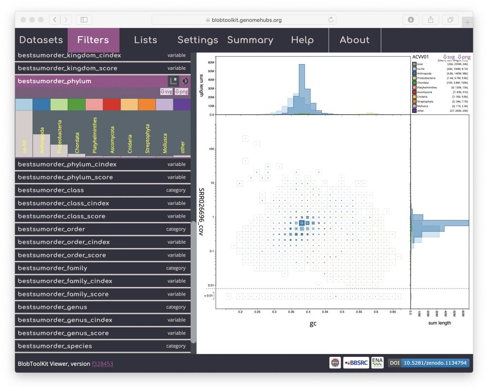
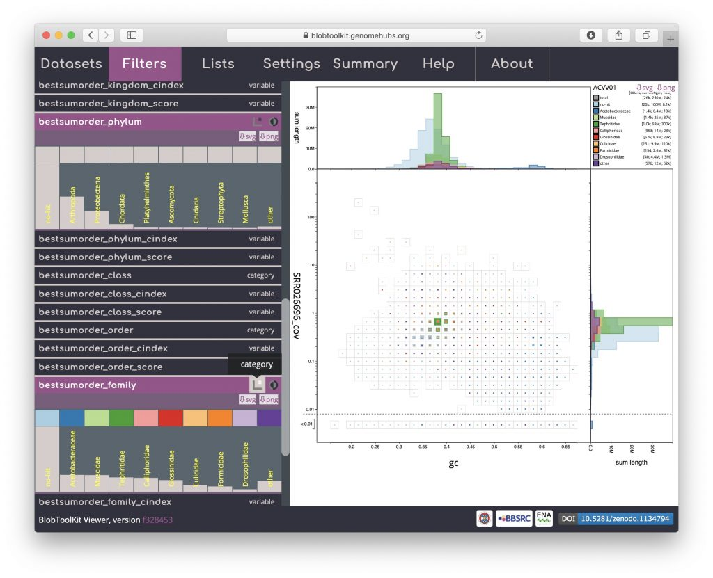

Blob plots show GC vs. coverage by default but can be adjusted to plot any available variable on either axis and to use alternative ranks (other than phylum) to set category colours using the _Filters_ menu.

Click on the "Filters" tab to display the _Filters_ menu. Active fields have a pink header and a histogram plot showing a preview of the field values. These preview histograms use a square-root scale on the _y_\-axis to ensure small values remain visible. Icons in the headers show which axis each field is currently assigned to (icons with dark backgrounds are active). For the default _blob_ plot with GC on the _x_\-axis, coverage on the _y_\-axis and scaled by length (_z_\-axis) the filters will look like this:

A useful plot type that can be obtained for datasets with more than one coverage library is a cov-cov plot, which shows the relative coverage of scaffolds based on the mapping information from the two libraries. The expectation is that true scaffolds will form a diagonal line in such a plot with possible contaminants showing up in scaffolds that have very different coverage in the two libraries and are a long way from the diagonal. To set up a cov-cov plot, firstly activate the _SRR026698\_cov_ field by clicking the header, it should in turn expand to show a preview histogram:

Then click the _x_\-axis icon in the _SRR026698\_cov_ field header to plot these values on the _x_\-axis. Most of the data are on the diagonal, as expected, however a proportion of the bins are below the 0.01 cutoff on each axis, reflecting scaffolds that are only supported by one of the coverage libraries. Some scaffolds have been placed in a bin that is below the cutoff on both axes, indicating that support for these scaffolds must come from read data that is not represented in this plot.

Reverting to the default GC vs coverage plot, scroll down the _Filters_ menu to see that the current category colours are defined by the _bestsumorder\_phylum_ field. The "bestsum\_" prefix reflects the taxrule that was used to assign a taxonomic rank based on sequence similarity search results. This field preview lists the ten categories ("no-hit" for scaffolds with no hit, eight phyla and "other" for the remaining phyla). The histogram reflects counts so the tallest bar is for no-hit, which contains the greatest number of scaffolds. The dark blue colour for Arthropoda is most prominent on the blob plot as the scaffolds in this category have the greatest span:

To change the rank used to set categories to family, click on "bestsumorder\_family" to expand the field then click on the category icon towards the right-hand end of the header:

