Each dataset is represented by several interactive views: _blob_, _cumulative_, _snail_ and _table_. For datasets with read data that have been mapped to the assembly, the _blob_ view is shown by default, otherwise the view defaults to _cumulative_ view. All views update automatically based on changes to filters (see _Filtering assemblies_) and other settings (see _Adjusting plot settings_). 

#### Changing views

For each dataset, available plot types are shown in the _Settings_ menu. To change view, click on settings at the top of the screen then click the name of an alternative view in the menu on the left-hand side. Additional configuration options for each view (see _Adjusting plot settings_) are also shown in the _Settings_ menu. All plots can be exported directly as image files by clicking the "svg" or "png" buttons at the top right corner:

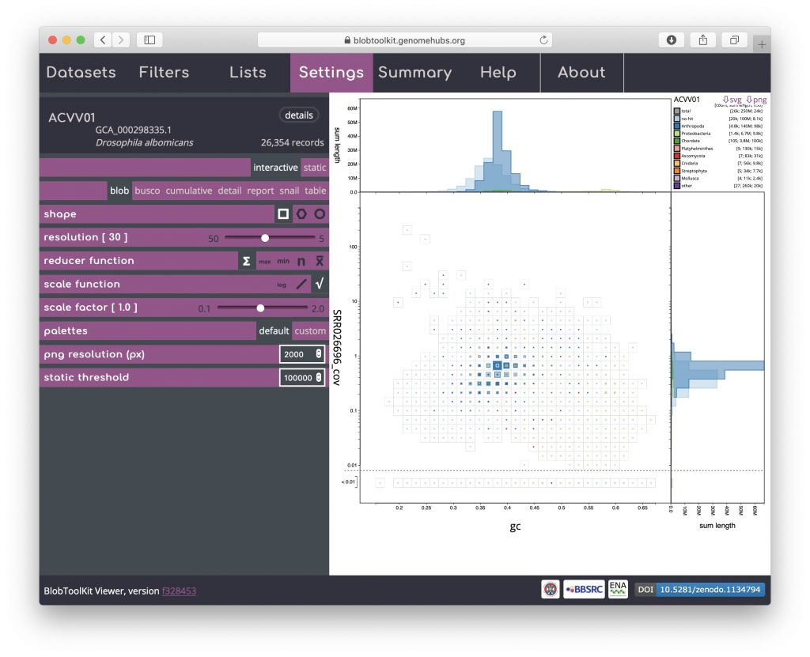

#### Blob (square-binned)

This is the default plot type (except for datasets with no coverage information, in which case the _cumulative_ view is shown by default). The three types of blob plot (see _Blob (hex-binned)_ and _Blob (circle)_ below) each show the positions of each contig on two axes: mean GC content on the _x_\-axis and mean per-base coverage on the _y_\-axis. Data points in a blob-plot are coloured by phylum and scaled by length. For the square-binned version, individual data points are binned along the _x_\- and _y_\-axes and the squares are scaled (using a square-root scale with the maximum size being the bin size) to represent the sum of scaffold lengths (span) for each phylum within each bin. Coverage is a log-scaled variable that can include zero. In order to plot this without adding an arbitrary number to each value, the axis is broken with all values below 0.01 (this value can be changed in the _Settings_ menu) plotted below the break:

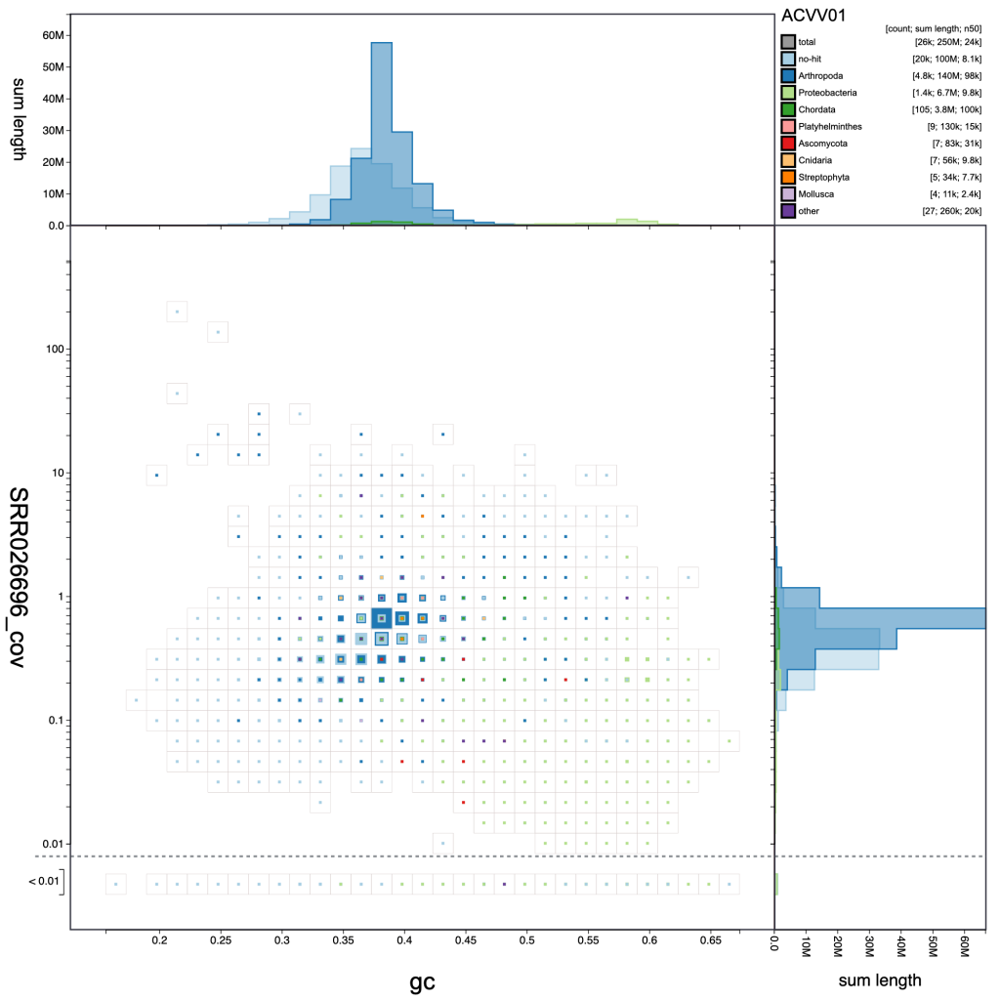

A binned, square-root scaled plot is used as the default as it avoids some of the visual artefacts associated with plotting all scaffolds as scaled circles, it can be drawn (and redrawn in response to changed filter parameters and settings) rapidly enough to scale to hundreds of thousands of scaffolds, and it allows for selection of arbitrary regions by clicking on bins to select all scaffolds in that bin (shown in pink below). Such selections can be used as the basis for filtering or querying the dataset (see _Using selections_). Basic information about the selected bins is highlighted in pink relative to the overall assembly values in the _Summary_ menu:

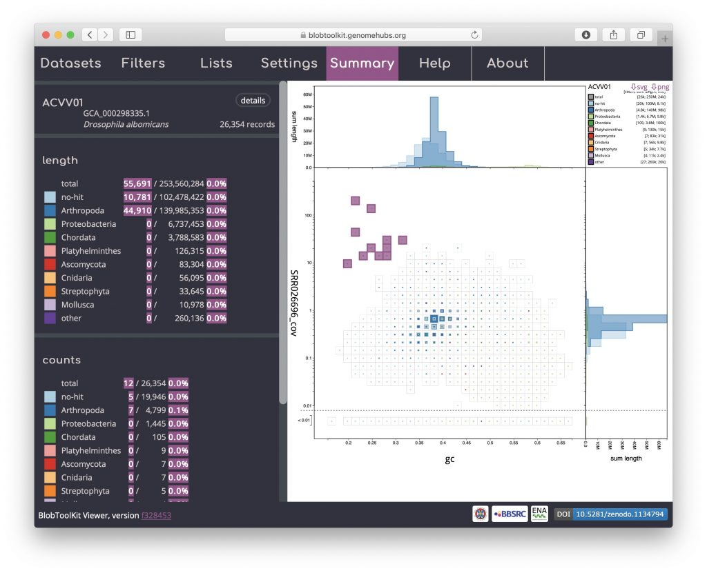

The default scaling de-emphasises regions of the plot which represent relatively small proportions of the overall assembly span. For some purposes, such as identifying small cobionts, this is a disadvantage relative to plotting scaled circles. Changing the _scale function_ to a log-scale provides a way to restore prominence to such features while retaining the advantages of binning (see _[Adjusting plot settings](https://blobtoolkit.genomehubs.org/btk-viewer/viewer-tutorials/adjusting-plot-settings/)_ for more ways to manipulate the plot):

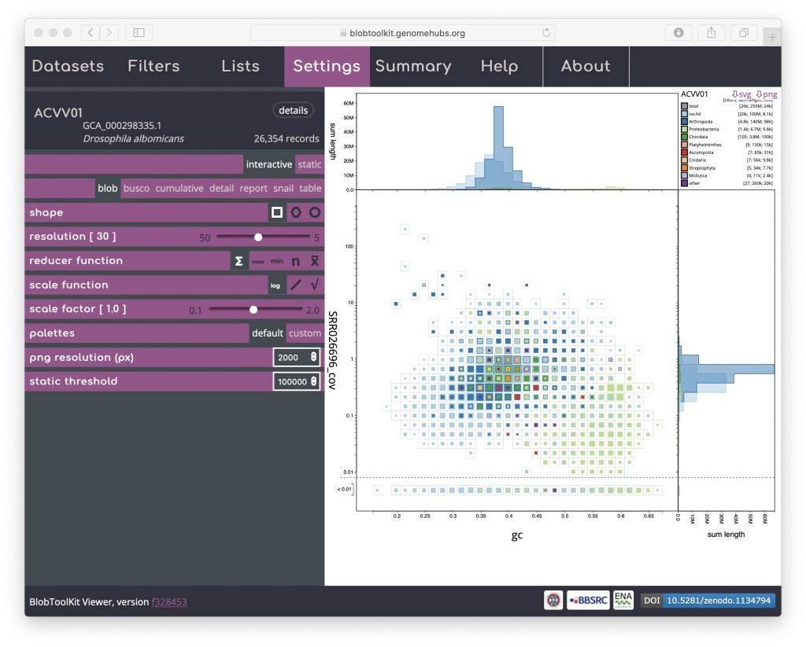

The default axes and taxonomic rank used to assign category colours can also be adjusted using controls in the Filters menu (see _[Changing plot axes](https://blobtoolkit.genomehubs.org/btk-viewer/viewer-tutorials/changing-plot-axes/)_).

#### Blob (hex-binned)

Click on the hexagon shape icon to change to a hex-binned blob plot. The hex-binned plot shares most of the features of the square-binned version but can have aesthetic advantages when dealing with features that are not aligned to the plot axes:

#### Blob (circle)

Click on the circle shape icon to change to a blob plot of scaled circles. Unlike the binned versions, one circle is drawn for each scaffold in the assembly. This is most similar to the plots produced by previous versions of [BlobTools](https://github.com/DRL/blobtools):

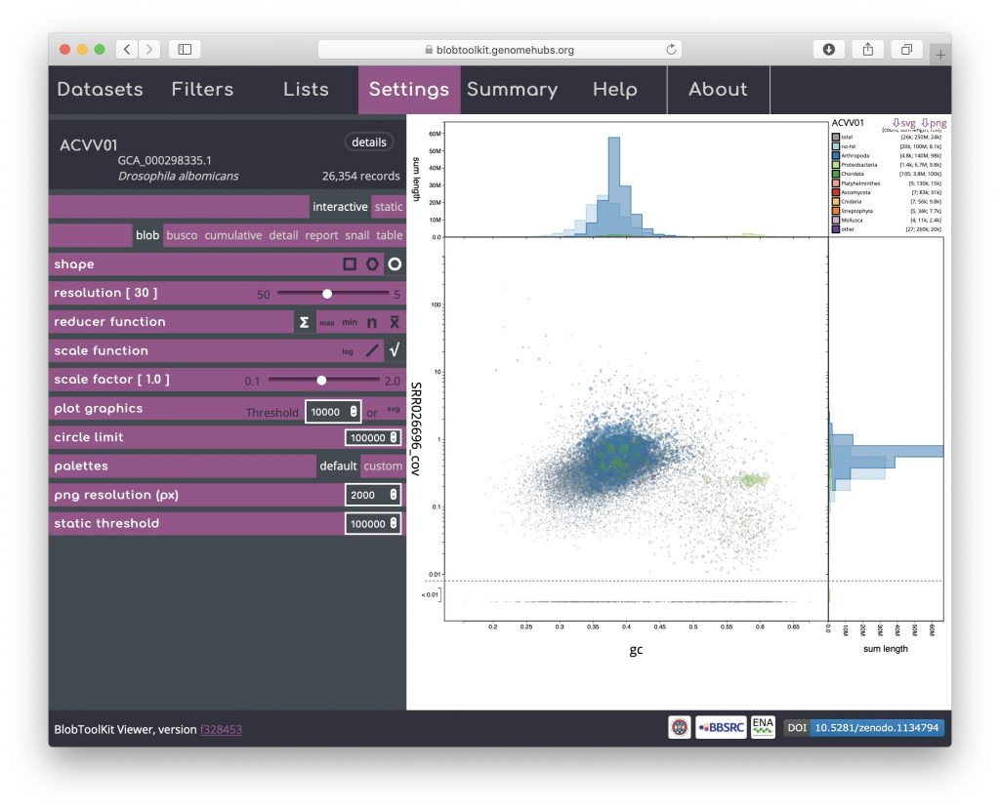

Rendering shapes for individual scaffolds has performance implications for large datasets so several parameters are available to allow circle plots to be viewed interactively without unduly reducing responsiveness (see [Viewing large datasets](https://blobtoolkit.genomehubs.org/btk-viewer/viewer-tutorials/viewing-large-datasets/)).

#### Cumulative

The cumulative view shows the length of the assembly as scaffolds are added from the longest to the shortest. The shape of the curve reflects the contiguity of an assembly. Cumulative curves are also shown for each phylum (or whichever rank has been selected to be used to assign categories, see _[Changing plot axes](https://blobtoolkit.genomehubs.org/btk-viewer/viewer-tutorials/changing-plot-axes/)_):

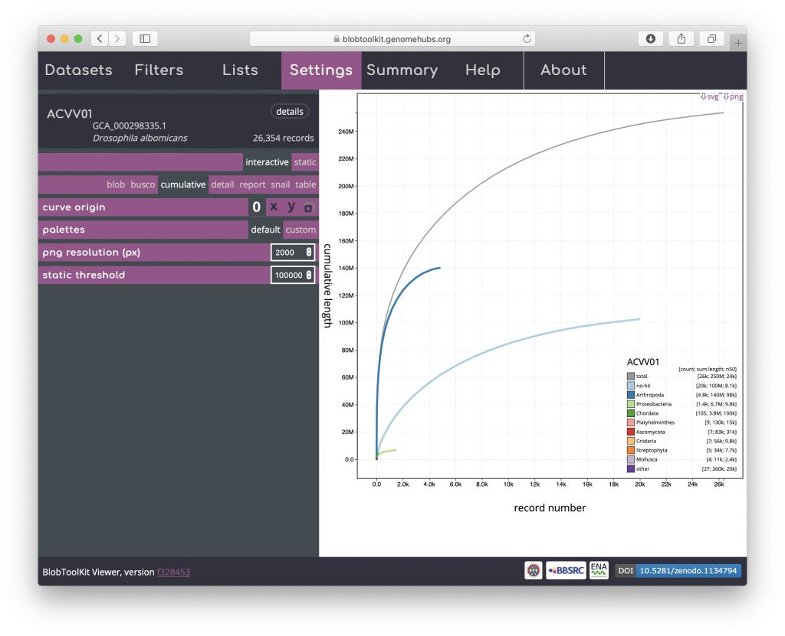

#### Cumulative (stacked)

The per-phylum cumulative curves can also be stacked so they have the same start and end points as the overall curve (shown in grey) by clicking the "x" or "y" curve origin icons. The changes in curve direction in this view can highlight the distribution of scaffold lengths across phyla:

#### Snail

Snail plots are based on the [assembly-stats](https://zenodo.org/badge/latestdoi/20772/rjchallis/assembly-stats) view used to convey several assembly metrics in a single graphic in [LepBase](http://lepbase.org) and other [GenomeHubs](https://genomehubs.org) sites. A red segment represents the longest scaffold while all other scaffolds are arranged in size-order moving clockwise around the plot and drawn in grey starting from the outside of the central plot. Dark and light orange arcs show the N50 and N90 values, which in this example are very small relative to the length of the longest scaffold. The central light grey spiral shows cumulative scaffold count with a white line at each order of magnitude. The dark vs. light blue area around the outside of the plot shows mean, maximum and minimum GC vs. AT content at 0.1% intervals. White regions in this area reflect the proportion of Ns in the assembly. If available, BUSCO scores are shown in the upper right-hand corner.

This example shows that a relatively small proportion of the genome is assembled into long scaffolds (also reflected in the low N50 value). The bumps in the GC portion of the plot (starting around 15% of the cumulative assembly length) highlight the inclusion of regions of differing base composition among the longer scaffolds of the assembly:

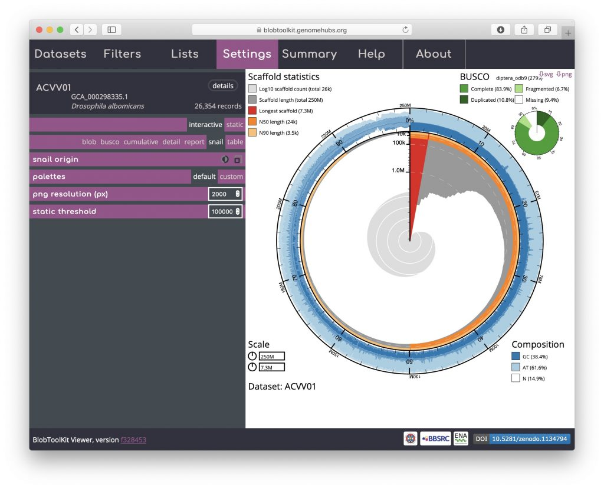

Hovering over any portion of the plot will show the N_x_ count and length values in the lower right-hand corner:

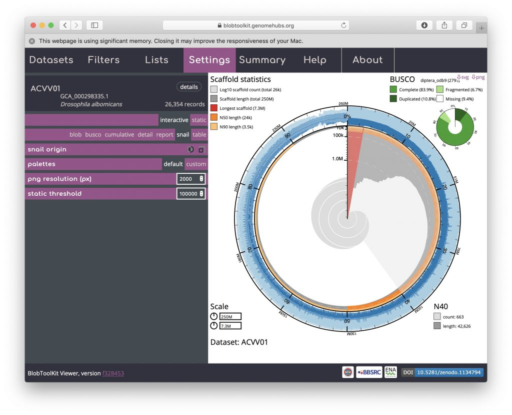

The circumferential and radial scales are set to the overall assembly span and length of the longest scaffold by default. These values can be changed by clicking on the scale boxes in the lower left-hand corner and entering a new value (that must be greater than or equal to the default), which can be useful for direct comparison of related assemblies. Changing the circumferential scale to 300,000,000 would look like this:

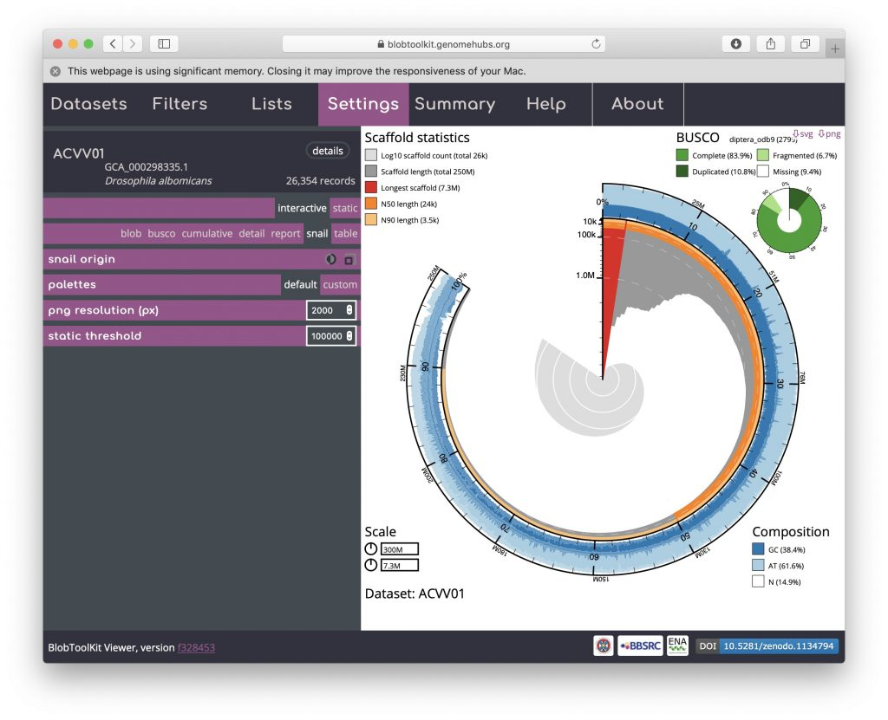

#### BUSCO

BUSCO analyses are shown both in tabular form and as a simple plot matching the BUSCO inset portion of the _snail_ view. For the public Viewer instance, BUSCO scores are available at all relevant taxonomic levels and are ordered from most specific to least specific (i.e. Eukaryota will always be at the bottom of the page). Buttons at the top of the view allow data for all analyses to be downloaded in a single JSON or CSV format file. Checkboxes in the left-hand column of each table allow all scaffolds with BUSCOs in that subset to be selected (see _[Using selections](https://blobtoolkit.genomehubs.org/btk-viewer/viewer-tutorials/using-selections/)_):

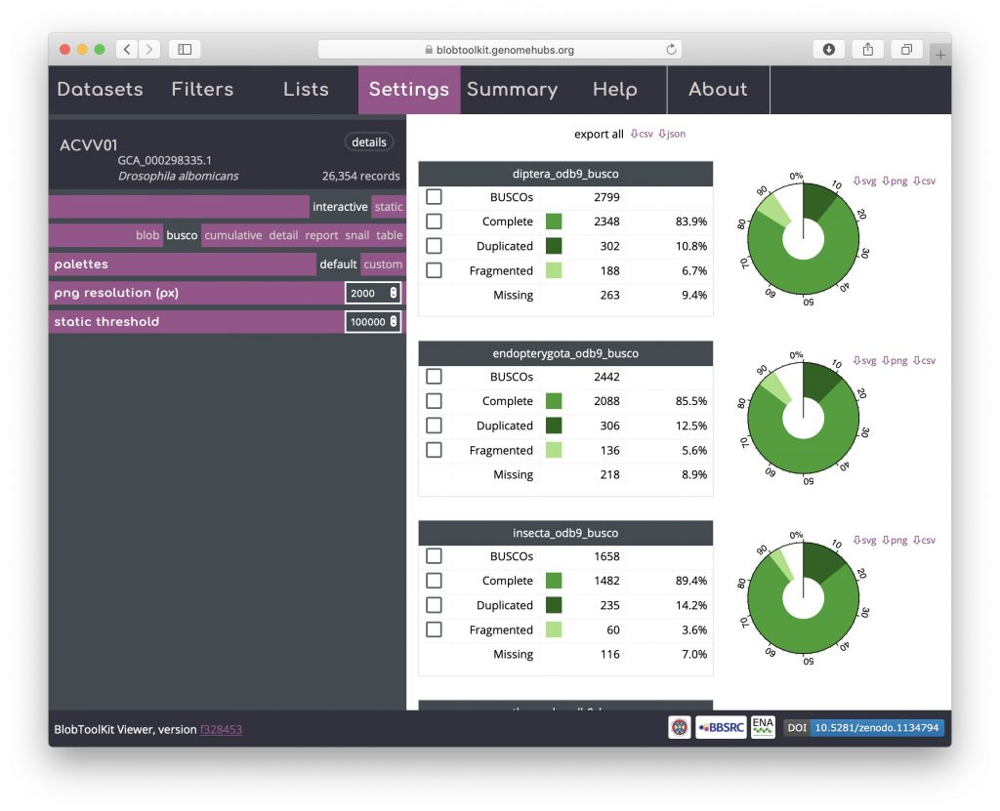

#### Detail

A subset of the dataset metadata is available in a formatted detail view that includes links to external resources. As this is a publicly available, INSDC-registered dataset, these include links to public records at the ENA and a Wikipedia link with more information about the taxon. Locally hosted instances can omit or configure these links as required. The full dataset metadata can be downloaded by clicking on the "json" button in the upper right-hand corner. For datasets produced using the [pipeline](https://blobtoolkit.genomehubs.org/pipeline/), details of the version used are included in this table to ensure reproducibility:

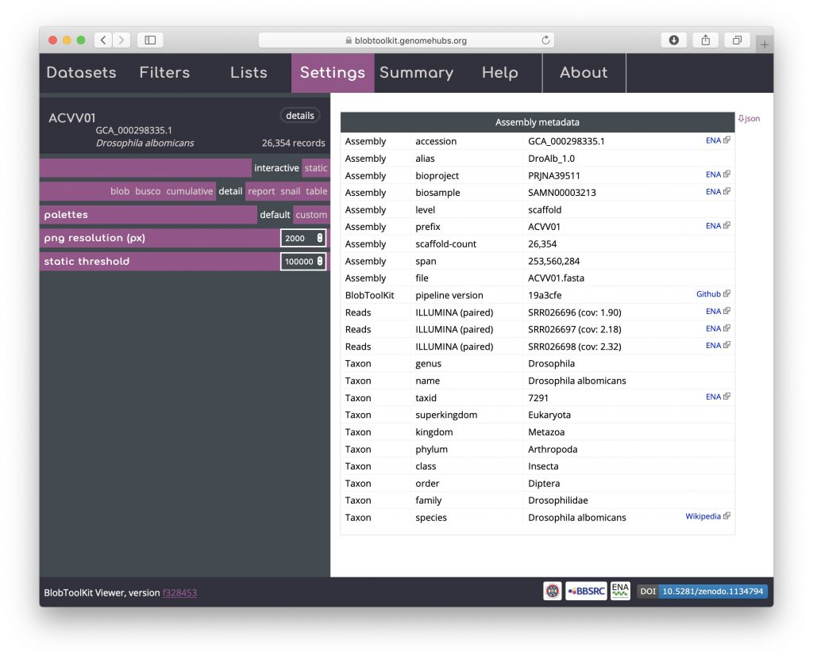

#### Table

The _table_ view shows one row per scaffold in the assembly with scores for each active field (see _Filtering assemblies_). The _Settings_ menu has been hidden in the screenshot below to leave more screen width for the table by clicking on the "Settings" tab. Clicking the tab again would cause it to be displayed again. The table can be sorted by clicking on any of the column headers and all data can be exported in CSV format by clicking on the "csv" button:

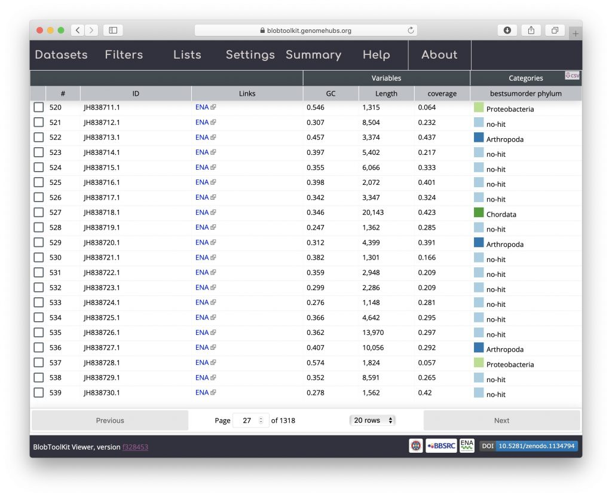

#### Hit distribution

For each scaffold in the _table_ view, clicking the coloured square next in the categories column brings up a plot showing the distribution of sequence similarity search results based on BLAST/Diamond analyses. For assemblies processed using the [INSDC-pipeline](https://blobtoolkit.genomehubs.org/pipeline/), long sequences (>100kb) are split into up to 10 chunks prior to running a BLAST search against the nt database. This avoids taxonomic inference being biased by strong hits in a small region of a scaffold. For each bin, corresponding hits are shown in a cumulative plot of bitscore against position, coloured by taxon. For hits that do not align directly above each other in this plot, dashed lines indicate membership of the same bin:

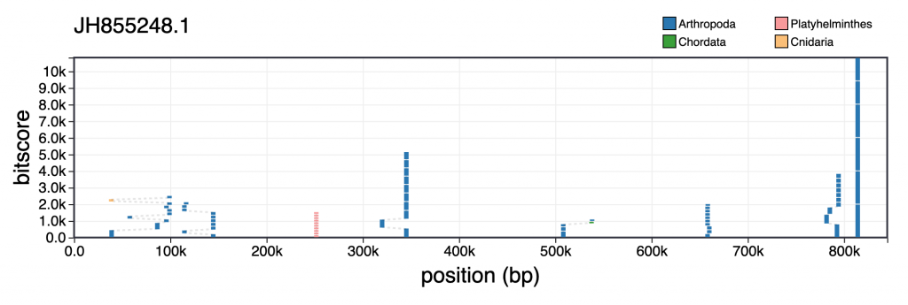

Hovering over individual hits brings up more information including the bitscore, start and end positions and accession number. Clicking a hit opens the entry for that hit in the relevant public database:

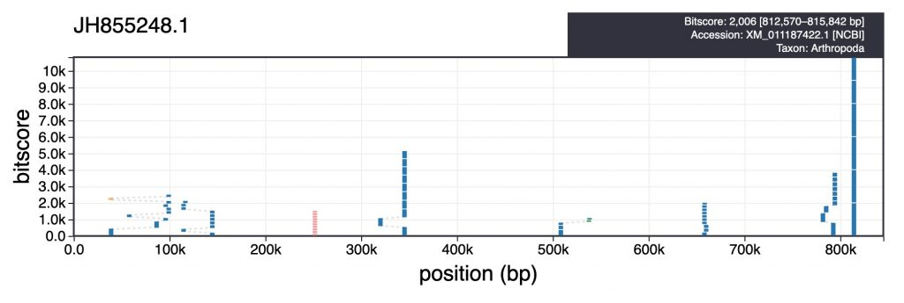
