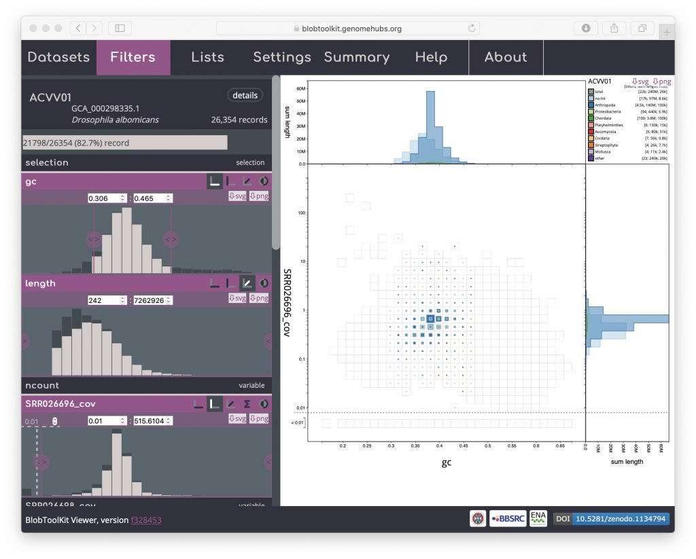
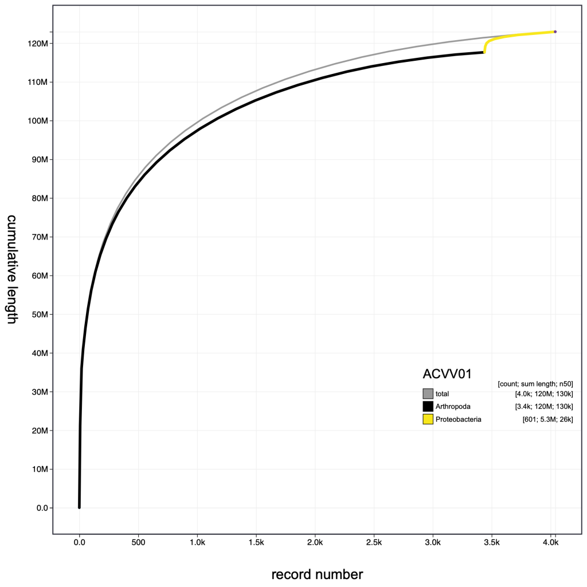
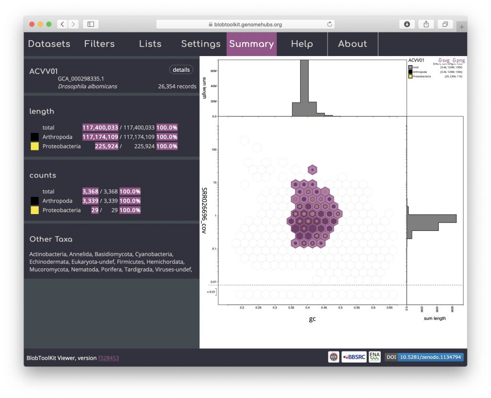
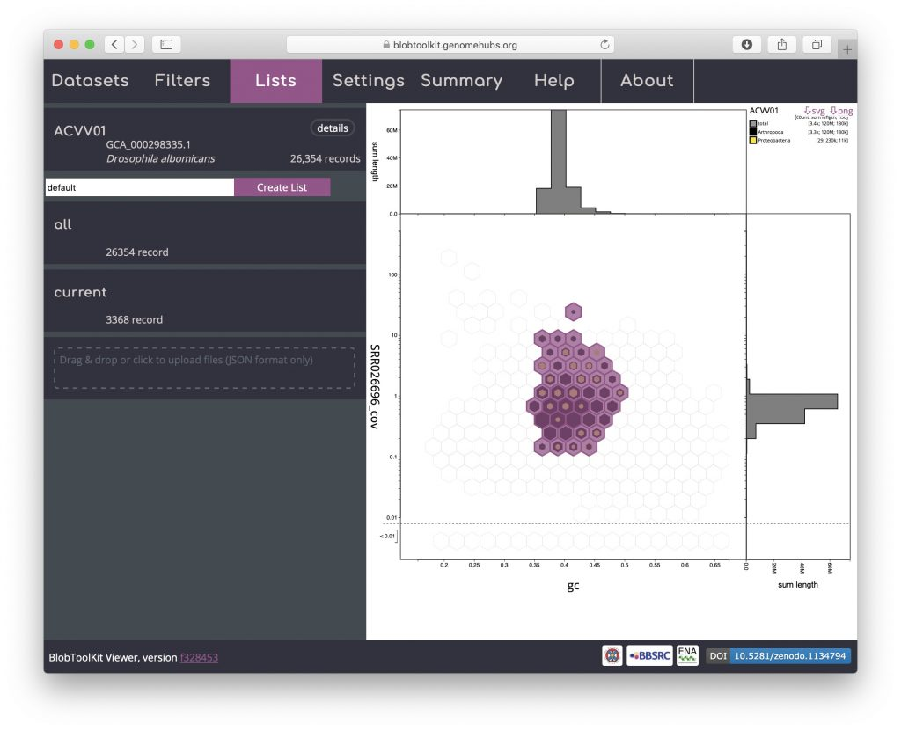
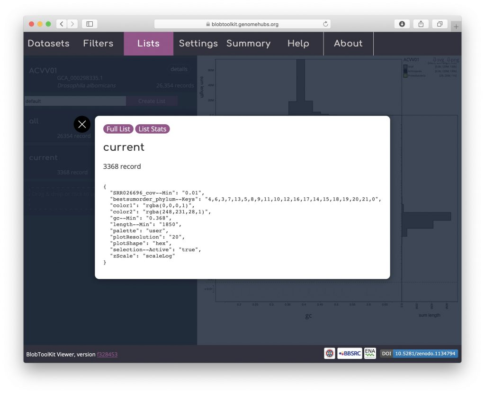
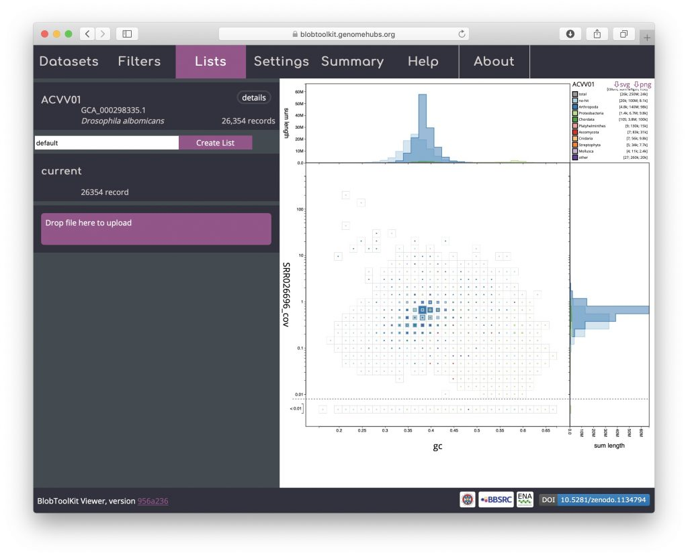
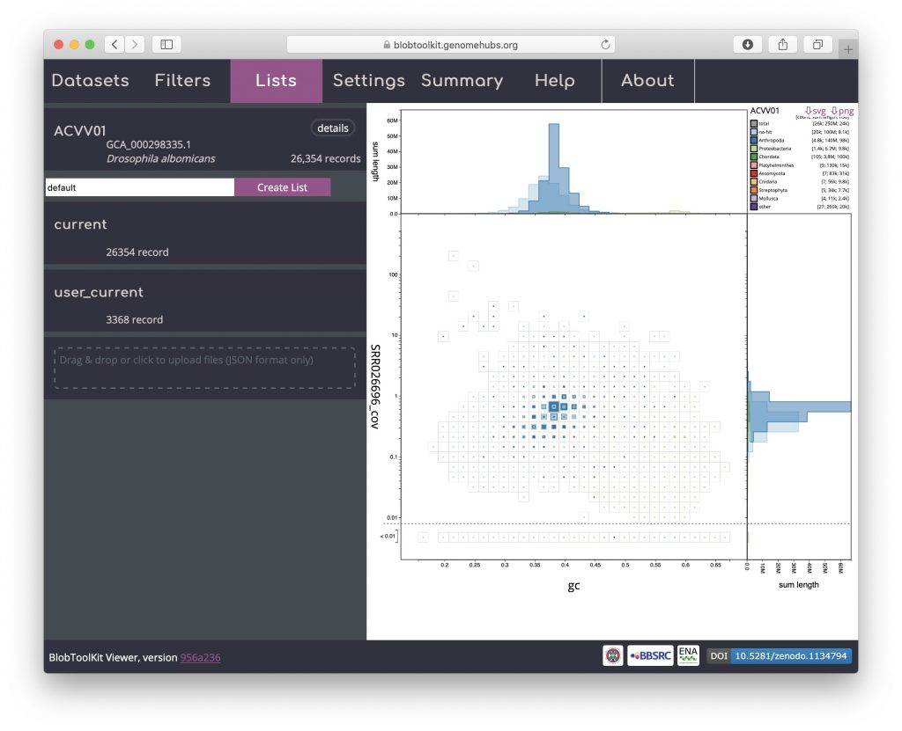
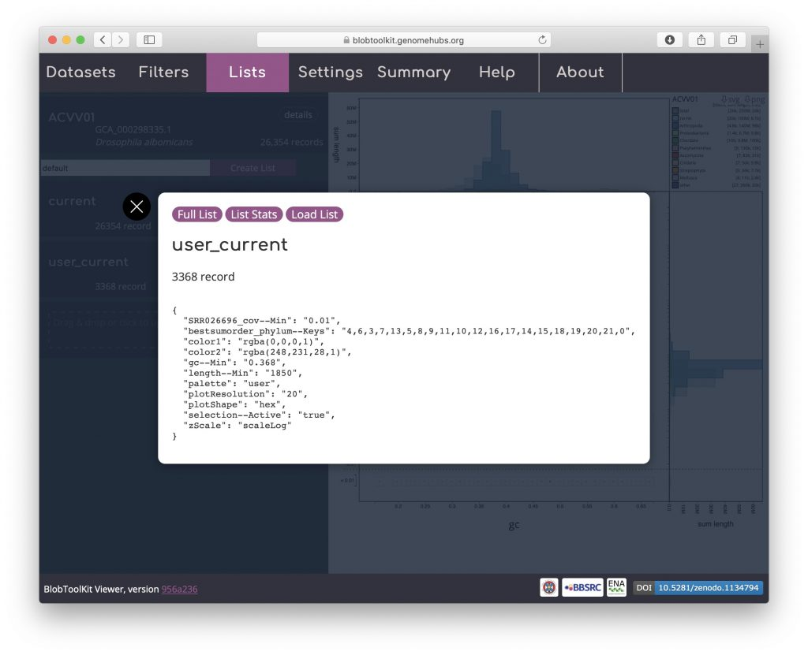
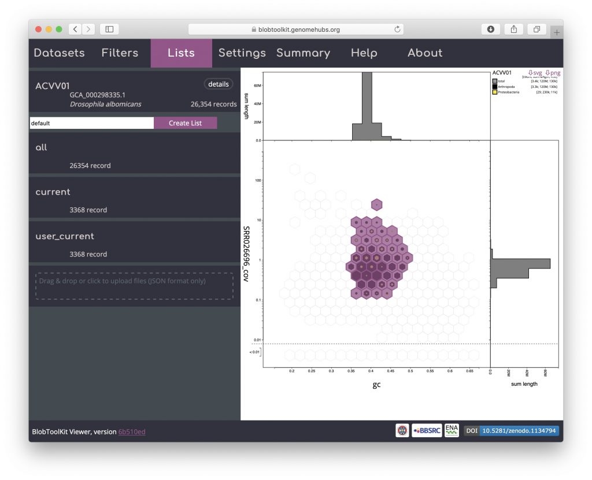
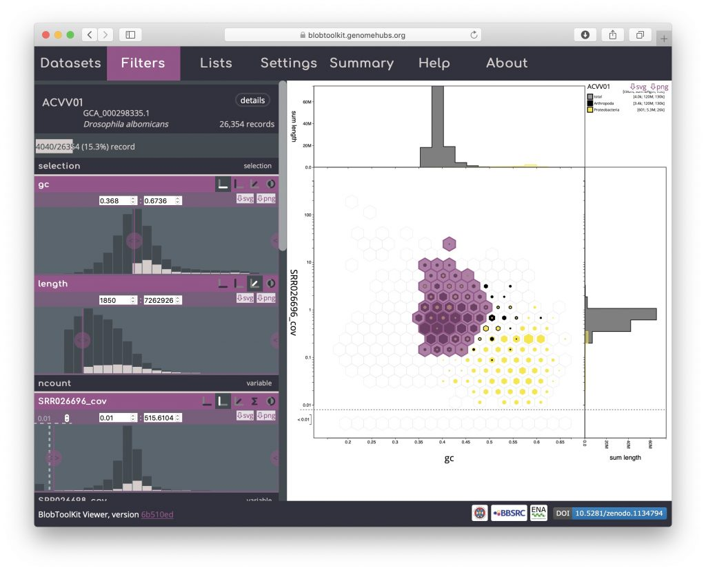

Most interactions with the Viewer automatically update the URL in your browser, allowing sessions to be saved, shared and restored by copying and pasting the URL from your browser's address bar. Selections cannot be stored in the URL but can be exported and reloaded along with all other parameter settings using the _Lists_ menu.

When you first open a dataset in the Viewer, the full URL will look like:

https://blobtoolkit.genomehubs.org/view/Drosophila/dataset/ACVV01/blob#Filters

This is made up of the base URL:

https://blobtoolkit.genomehubs.org/view

The search term:

/Drosophila

The dataset ID:

/dataset/ACVV01

The view type:

/blob

And the current menu (if shown):

#Filters

After interactively applying GC and coverage-based filters to obtain a filtered plot:



The URL will be updated with the addition of a query string:

?gc--Min=0.306&gc--Max=0.465&SRR026696\_cov--Min=0.0100

Other parameter settings and view types are encoded in the URLs when they are displayed so the following images can be reproduced in the public Viewer instance at [blobtoolkit.genomehubs.org/view](https://blobtoolkit.genomehubs.org/view) using the links below the images:


[Open in Viewer](https://blobtoolkit.genomehubs.org/view/Drosophila/dataset/ACVV01/blob?gc--Min=0.368&SRR026696_cov--Min=0.01&plotShape=hex&bestsumorder_phylum--Keys=4%2C6%2C3%2C7%2C13%2C5%2C8%2C9%2C11%2C10%2C12%2C16%2C17%2C14%2C15%2C18%2C19%2C20%2C21%2C0&length--Min=1850&zScale=scaleLog&plotResolution=20&palette=user&color1=rgba%280%2C0%2C0%2C1%29&color2=rgba%28248%2C231%2C28%2C1%29)



[Open in Viewer](https://blobtoolkit.genomehubs.org/view/Drosophila/dataset/ACVV01/cumulative?gc--Min=0.368&SRR026696_cov--Min=0.01&bestsumorder_phylum--Keys=4%2C6%2C3%2C7%2C13%2C5%2C8%2C9%2C11%2C10%2C12%2C16%2C17%2C14%2C15%2C18%2C19%2C20%2C21%2C0&length--Min=1850&zScale=scaleLog&palette=user&color1=rgba%280%2C0%2C0%2C1%29&color2=rgba%28248%2C231%2C28%2C1%29&scaleTo=filtered&curveOrigin=y)

Selection based filters cannot be stored in the URL as the list of scaffolds can easily be too long. In the example below, the selection includes over 3000 scaffolds distributed across 43 bins:



Details of the selected scaffolds can be exported using the _Lists_ menu. This menu may take a few seconds to load as it generates summary statistics that require additional fields to be processed:



Click on "current" to bring up a dialog box with a summary of the current parameter settings:



Click "Full List" to download a JSON format file containing these parameters, a set of summary statistics based on the filtered assembly and a list of scaffold identifiers in the filtered set. Alternatively click "List stats" to obtain a smaller file that omits the list of identifiers:

```
{
  "id": "current",
  "datasetId": "ACVV01",
  "taxon": "Drosophila albomicans",
  "taxid": 7291,
  "search": "Drosophila",
  "params": {
    "gc--Min": "0.368",
    "SRR026696_cov--Min": "0.01",
    "plotShape": "hex",
    "bestsumorder_phylum--Keys":
      "4,6,3,7,13,5,8,9,11,10,12,16,17,14,15,18,19,20,21,0",
    "length--Min": "1850",
    "zScale": "scaleLog",
    "plotResolution": "20",
    "palette": "user",
    "color1": "rgba(0,0,0,1)",
    "color2": "rgba(248,231,28,1)",
    "selection--Active": "true"
  },
  "identifiers": [
    "JH838202.1",
    "JH838217.1",
    "JH838233.1",
    ...
  ],
  "summaryStats": {
    "hits": {
      "total": {
        "span": 117400033,
        "count": 3368,
        "n50": 133946,
        "l50": 119,
        "n90": 12358,
        "l90": 1530
      },
      "no-hit": { "count": 0, "span": 0, "n50": 0 },
      "Arthropoda": { "count": 3339, "span": 117174109, "n50": 133946 },
      "Proteobacteria": { "count": 29, "span": 225924, "n50": 10606 },
      "Chordata": { "count": 0, "span": 0, "n50": 0 },
      "Platyhelminthes": { "count": 0, "span": 0, "n50": 0 },
      "Ascomycota": { "count": 0, "span": 0, "n50": 0 },
      "Cnidaria": { "count": 0, "span": 0, "n50": 0 },
      "Streptophyta": { "count": 0, "span": 0, "n50": 0 },
      "Mollusca": { "count": 0, "span": 0, "n50": 0 },
      "other": { "count": 0, "span": 0, "n50": 0 }
    },
    "taxonomy": {
      "taxid": 7291,
      "lineage":
        "Eukaryota; Metazoa; Arthropoda; Insecta; Diptera; Drosophilidae; Drosophila; Drosophila albomicans",
      "target": "Arthropoda",
      "targetRank": "phylum"
    },
    "baseComposition": { "at": 0.607, "gc": 0.393, "n": 0 },
    "busco": {
      "diptera_odb9": {
        "c": 2124,
        "d": 229,
        "m": 508,
        "f": 167,
        "t": 2799,
        "s": 1895,
        "string": "C:75.9%[S:67.7%,D:8.2%],F:6.0%,M:18.1%,n:2799"
      },
      "endopterygota_odb9": {
        "c": 1905,
        "d": 232,
        "m": 421,
        "f": 116,
        "t": 2442,
        "s": 1673,
        "string": "C:78.0%[S:68.5%,D:9.5%],F:4.8%,M:17.2%,n:2442"
      },
      "insecta_odb9": {
        "c": 1335,
        "d": 169,
        "m": 274,
        "f": 49,
        "t": 1658,
        "s": 1166,
        "string": "C:80.5%[S:70.3%,D:10.2%],F:3.0%,M:16.5%,n:1658"
      },
      "arthropoda_odb9": {
        "c": 882,
        "d": 106,
        "m": 165,
        "f": 19,
        "t": 1066,
        "s": 776,
        "string": "C:82.7%[S:72.8%,D:9.9%],F:1.8%,M:15.5%,n:1066"
      },
      "metazoa_odb9": {
        "c": 793,
        "d": 113,
        "m": 162,
        "f": 23,
        "t": 978,
        "s": 680,
        "string": "C:81.1%[S:69.5%,D:11.6%],F:2.4%,M:16.6%,n:978"
      },
      "eukaryota_odb9": {
        "c": 256,
        "d": 37,
        "m": 45,
        "f": 2,
        "t": 303,
        "s": 219,
        "string": "C:84.5%[S:72.3%,D:12.2%],F:0.7%,M:14.9%,n:303"
      }
    },
    "stats": { "noHit": 0, "target": 0.998, "spanOverN50": 876 },
    "readMapping": {
      "SRR026696": {
        "total": 5479159,
        "coverage": 1.9013791923,
        "mapped": 2787530,
        "mappedPortion": 0.509,
        "platform": "ILLUMINA",
        "strategy": "paired"
      },
      "SRR026697": {
        "total": 6274274,
        "coverage": 2.1772114753,
        "mapped": 3744118,
        "mappedPortion": 0.597,
        "platform": "ILLUMINA",
        "strategy": "paired"
      },
      "SRR026698": {
        "total": 6692136,
        "coverage": 2.3223214248,
        "mapped": 3774525,
        "mappedPortion": 0.564,
        "platform": "ILLUMINA",
        "strategy": "paired"
      }
    }
  }
}
```

The "summaryStats" section of this file contains the information that is used for the dataset table display on the homepage of the public viewer instance.

To load parameters from a list, reload the dataset in a new browser window and open the _Lists_ menu. Drag and drop the list file downloaded in the previous step onto the area labelled "Drag & drop or click to upload files (JSON format only)":



The uploaded list will be added to the _Lists_ menu. Uploaded list names are prefixed "user\_" to avoid conflicting with existing named lists. The summary of the number of records in the "user\_current" list shows that it contains 3368 records:



As for downloading a list, click "user\_current" to bring up a dialog box with a summary of the parameter settings for the list:



Click "Load List" to reload this list:



The list was created with an active selection filter so the bins containing selected records are highlighted. Switch off selection-based filtering to see the filtered dataset based on parameters alone:


