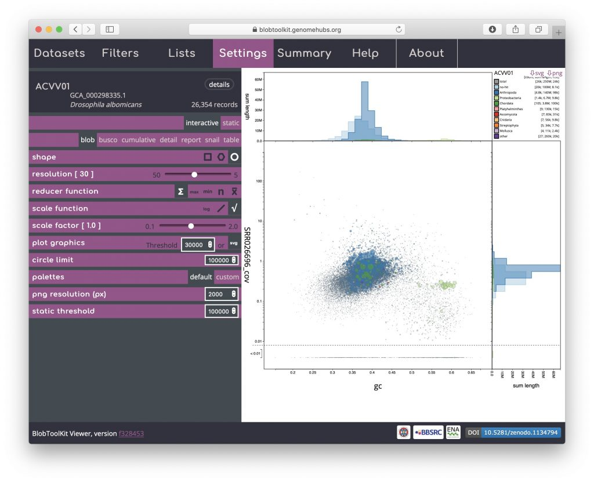
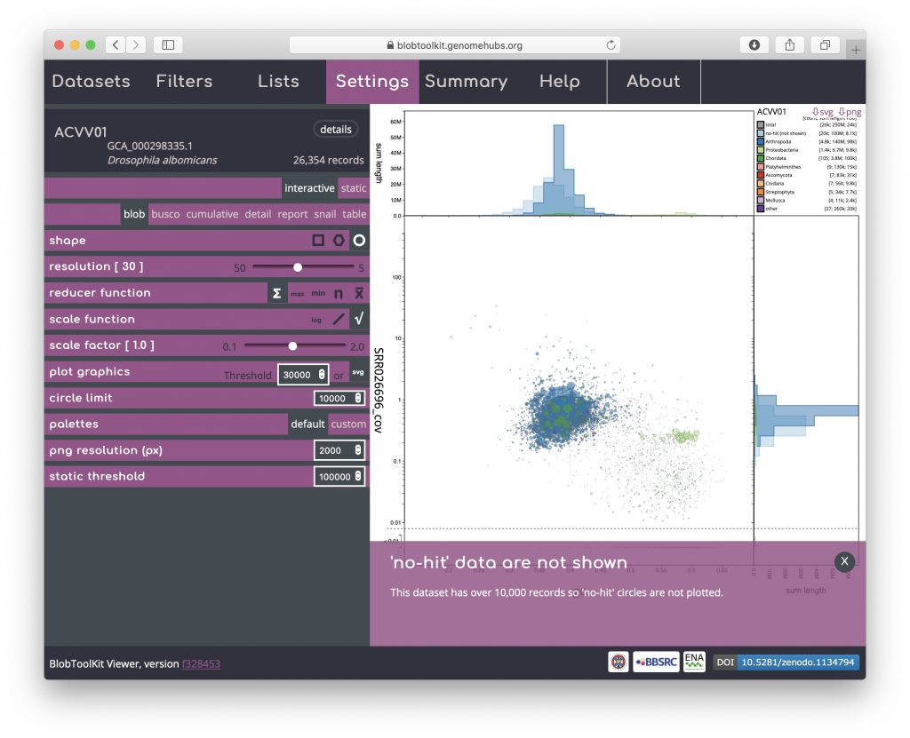
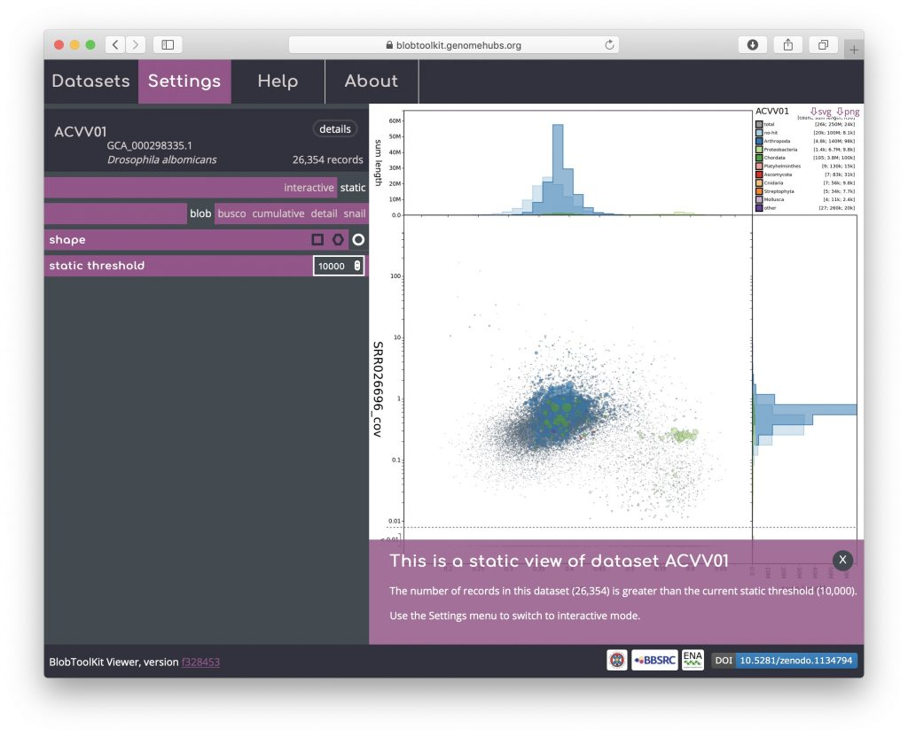

The Viewer is designed to allow browser-based interactive exploration down to the individual scaffold level of preliminary and published datasets. For particularly fragmented assemblies, this can involve processing several million individual scaffolds so several options allow such assemblies to be displayed without losing responsiveness.

Rendering shapes for individual scaffolds has performance implications for large datasets so binned plots are shown by default. Aside from this, several parameters are available to allow circle plots to be viewed interactively without unduly reducing responsiveness (or causing the browser to crash). The _**plot graphics**_ _Threshold_ is set to 10,000 by default. For datasets with more than 10,000 scaffolds the circle plot will be rendered using HTML5 canvas (as a bitmap image) rather than SVG. This reduces the number of elements held in the browser's memory and is suitable for viewing, but cannot be exported as an image using the buttons at the top-right of the plot. In order to make the image exportable, either type a value for the plot graphics threshold that is greater than the number of scaffolds, or click the svg icon in the settings menu to force the browser to render an SVG image:

The _**circle limit**_ parameter limits how many circles will be drawn by removing "no-hit" circles from the plot before rendering circles. A large proportion of the scaffolds in a highly fragmented assembly can betook short to have sequence similarity search hits to records in the public databases so removing the "no-hit" circles reduces the computational load while retaining most of the information content of the plot. The default value for this parameter is 100,000 but it may be raised in order to allow all data to be plotted, or lowered (as in the example below) to avoid plotting such circles for smaller datasets:

For the public instance of the Viewer, a set of images or the required summary statistics are generated for the main views using the Command Line Interface (see _Using the CLI_). These are then presented as a series of static views for datasets with more scaffolds than the default value of the _**static threshold**_ parameter, which is 100,000. Presenting static images for datasets with over 100,000 scaffolds allows all datasets to be viewed, even on relatively low-powered mobile devices. Static versions of the plots are accompanied by a warning message as below where the _**static threshold**_ has been set to 10,000 for a dataset of over 26,000 scaffolds.

For users who wish to explore the datasets interactively, the threshold may be increased and datasets much larger than 100,000 scaffolds can be viewed interactively on a modern laptop computer. Assuming hardware is not a limiting factor, datasets with over 2,000,000 scaffolds may need to be viewed using Firefox as other browsers restrict the available RAM.
