Assemblies can be filtered interactively by setting variable value ranges or selecting taxonomic categories in the _Filters_ menu. Individual scaffolds or all scaffolds in specific bins can also be filtered based on selections.

Click on the "Filters" tab to open the _Filters_ menu. The examples in this section use log-scaled counts (see [Adjusting plot settings](https://blobtoolkit.genomehubs.org/btk-viewer/viewer-tutorials/adjusting-plot-settings/)) to make the effect of the filters more obvious. To apply a filter based on a variable value, drag one or both of the sliders over the preview histogram:

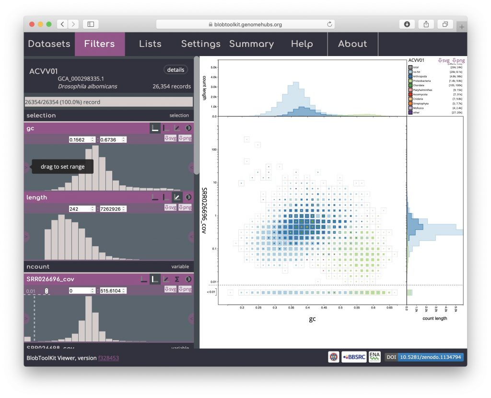

The preview histograms and any plots will update when you release the slider. For example, filtering high and low GC updates the current view:

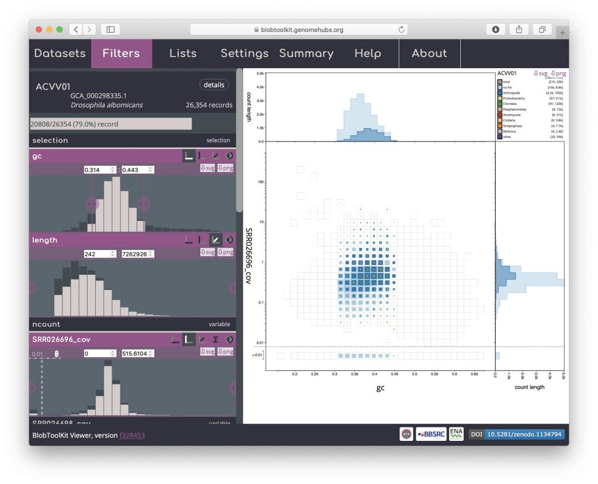

All filter settings are retained when switching to alternate views (see [Exploring views](https://blobtoolkit.genomehubs.org/btk-viewer/viewer-tutorials/exploring-views/)):

- 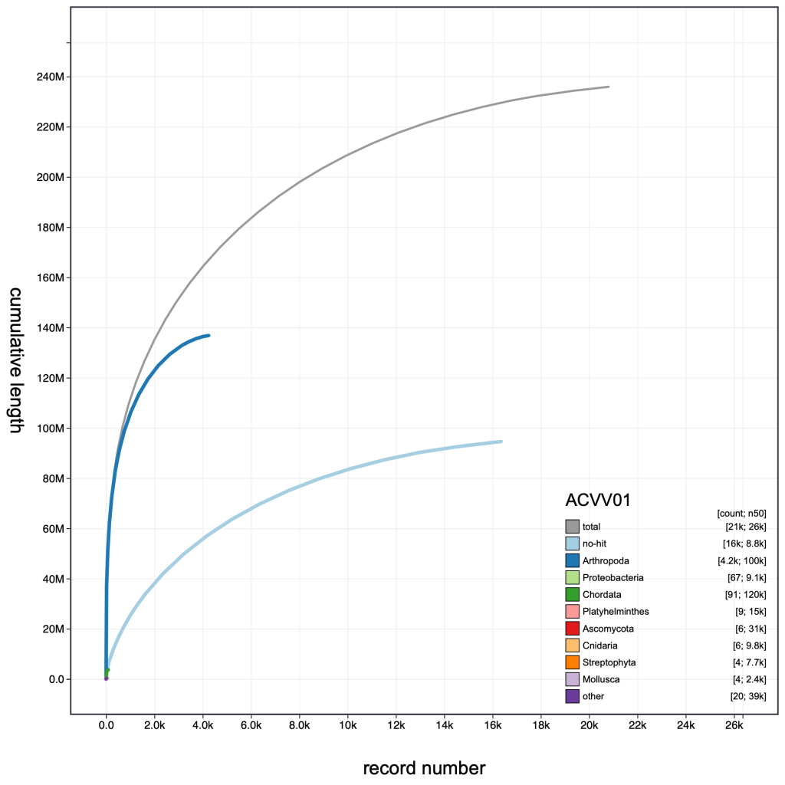
    
- 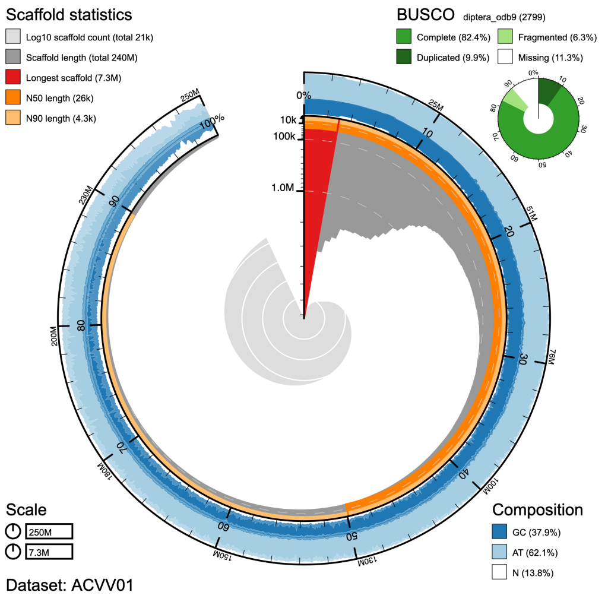
    
- 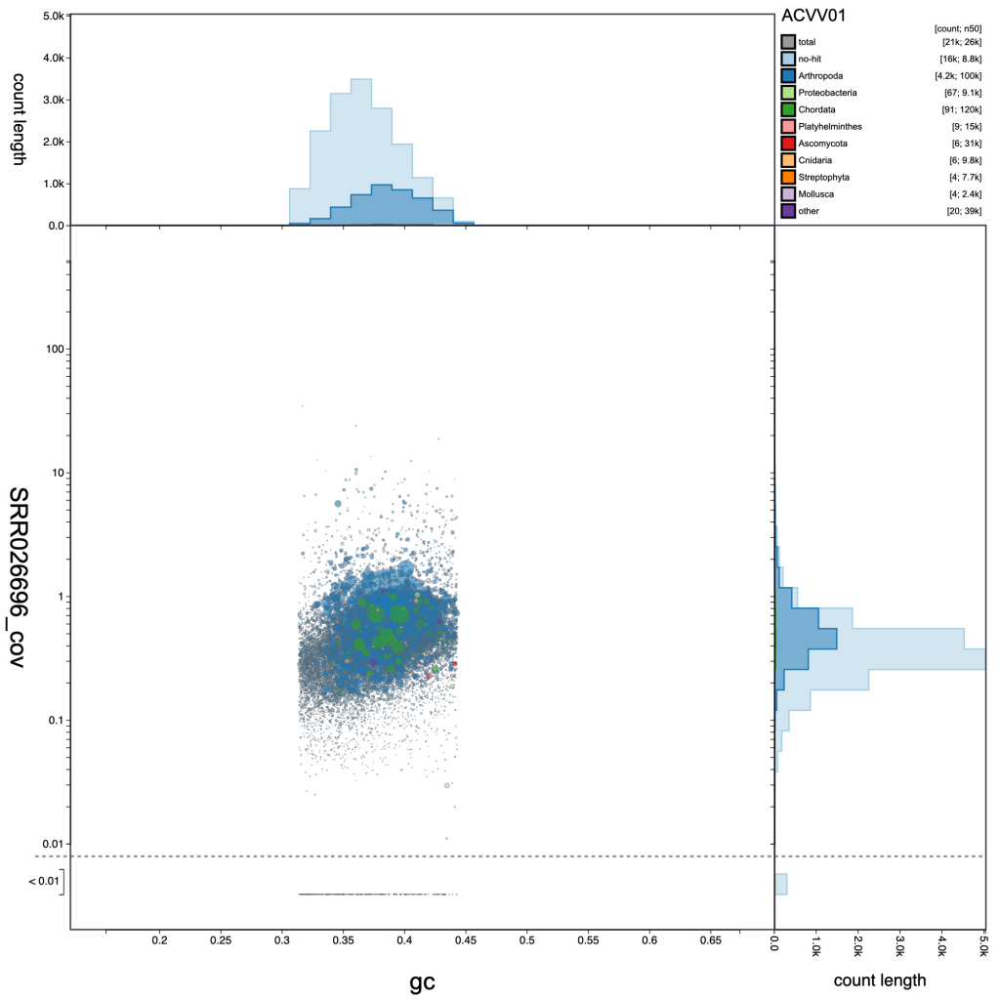
    

Specific values can be set for filters by entering maximum and or minimum values directly, for example setting the minimum length to 5,000:

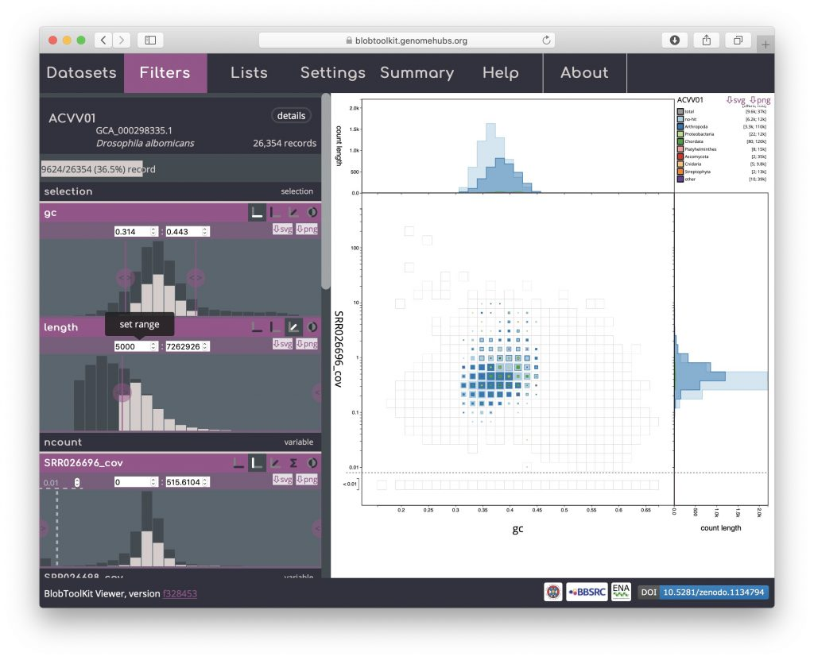

Any filter can be inverted by clicking the _invert_ icon in the field header to exclude rather than include scaffolds matching the filter criteria:

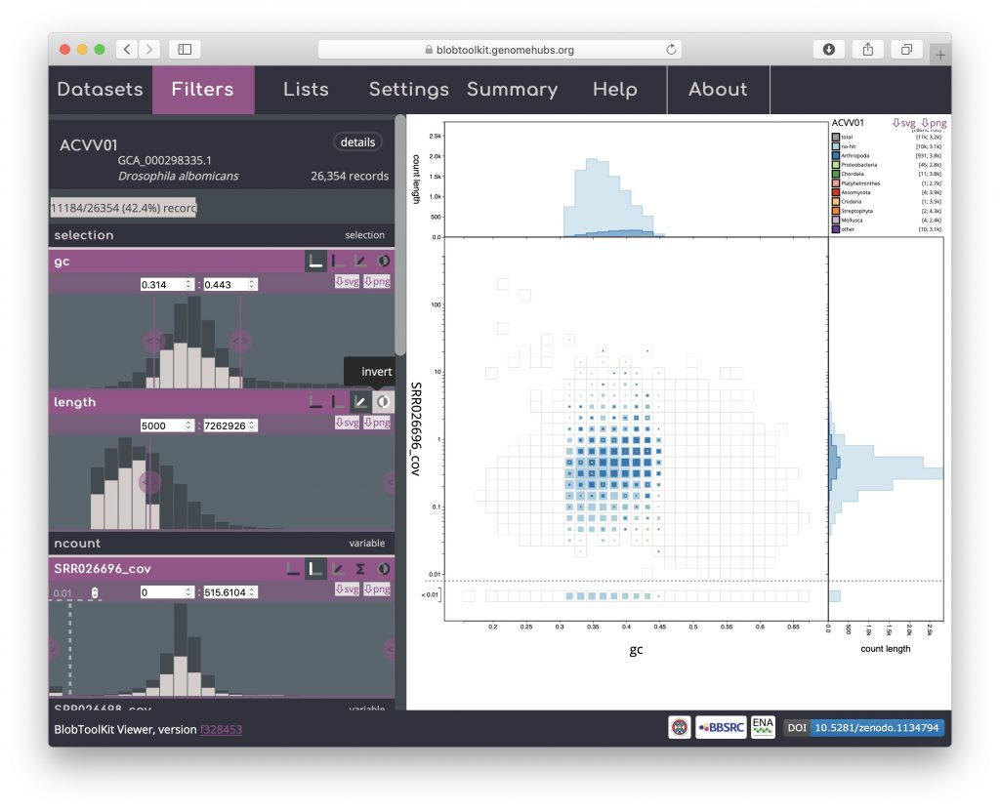

To filter based on taxonomic categories, click one or more of the coloured swatches at the top of the preview histogram to toggle the categories on or off. For example, excluding "no-hit" sequences (with the other filters reset to include all scaffolds):

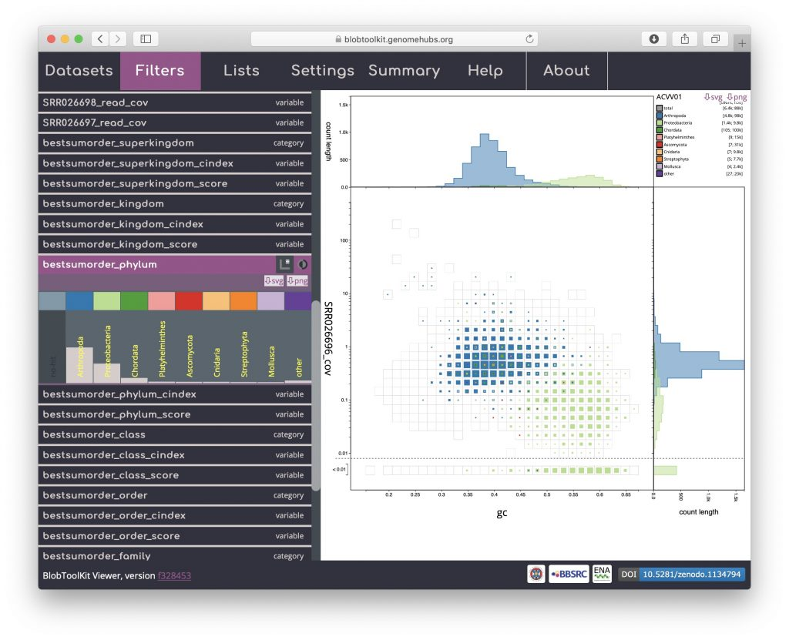

To filter based on a selection (see _Using selections_), first make a selection, in this case a purely arbitrary shape:

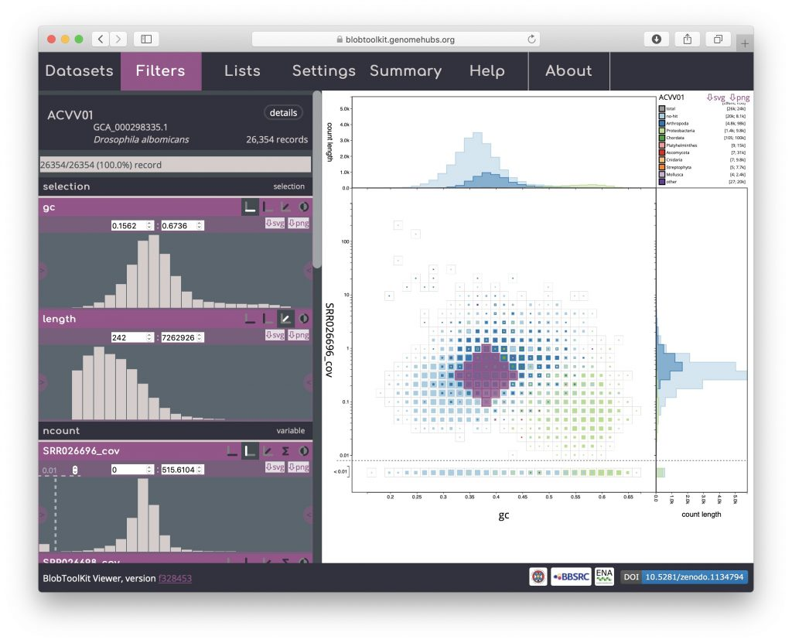

Then click on the _selection_ filter header to activate it:

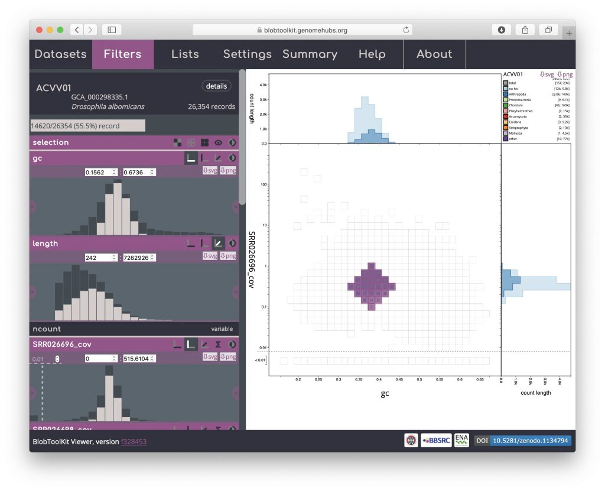

As with the other filters, selection-based filters can be inverted:

And combined with other filters, for example, excluding scaffolds with coverage below the low-coverage threshold:

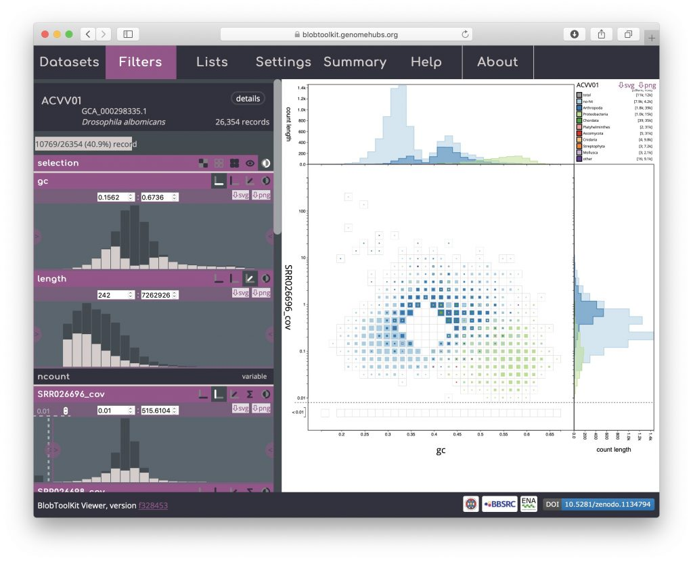
