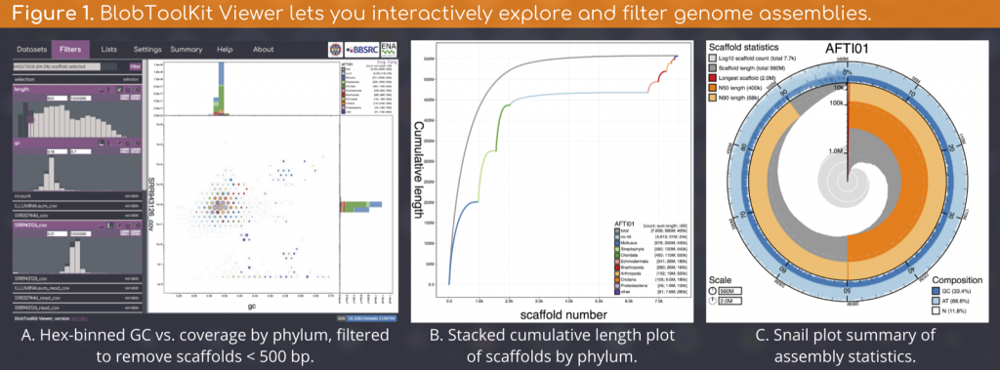

Our preprint is out in bioRxiv: [https://www.biorxiv.org/content/10.1101/844852v1](https://www.biorxiv.org/content/10.1101/844852v1)

Filtering raw genomic datasets is essential to avoid chimeric assemblies and to increase the validity of sequence-based biological inference. BlobToolKit extends the BlobTools1/Blobology2 approach to simplify interactive and reproducible filtering.

BlobToolKit is comprised of four components:

1. [BlobToolKit Viewer](https://blobtoolkit.genomehubs.org/btk-viewer/) allows browser-based interactive visualisation and filtering of preliminary or published genomic datasets even for highly fragmented assemblies.
2. [BlobTools2](https://blobtoolkit.genomehubs.org/blobtools2/) is a command-line program to convert assemblies and analysis results into datasets that can be further processed using [BlobTools2](https://blobtoolkit.genomehubs.org/blobtools2/) and/or visualised in the Viewer.
3. The [BlobToolKit Specification](https://blobtoolkit.genomehubs.org/specification/) features a formal schema and validator for the JSON-based BlobDir format used by [BlobTools2](https://blobtoolkit.genomehubs.org/blobtools2/) and the [Viewer](https://blobtoolkit.genomehubs.org/btk-viewer/).
4. The [BlobToolKit Pipeline](https://blobtoolkit.genomehubs.org/pipeline/) is a configurable Snakemake pipeline that automates all steps from retrieving public datasets through running analyses and generating a BlobDir dataset with [BlobTools2](https://blobtoolkit.genomehubs.org/blobtools2/), ready for visualisation in the [Viewer](https://blobtoolkit.genomehubs.org/btk-viewer/).

The Viewer features multiple views and data export options that dynamically update as filter parameters and selections are modified (Figure 1).

We are running the [BlobToolKit pipeline](https://github.com/blobtoolkit/insdc-pipeline) (Figure 2) on all public (INSDC registered) eukaryote genome assemblies and making the results available on a public instance off the Viewer at [blobtoolkit.genomehubs.org/view](https://blobtoolkit.genomehubs.org/view).

1Kumar _et al._ 2013. Blobology: exploring raw genome data for contaminants, symbionts and parasites using taxon-annotated GC-coverage plots. [_Frontiers in Genetics_, **4**:237](https://www.ncbi.nlm.nih.gov/pmc/articles/PMC3843372/)

2 Laetsch & Blaxter 2017. BlobTools: Interrogation of genome assemblies \[version 1; referees: awaiting peer review\]. _F1000Research_, **6**:1287 (doi: [10.12688/f1000research.12232.1](https://dx.doi.org/10.12688/f1000research.12232.1))
