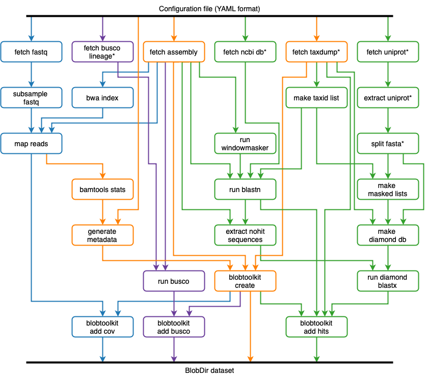
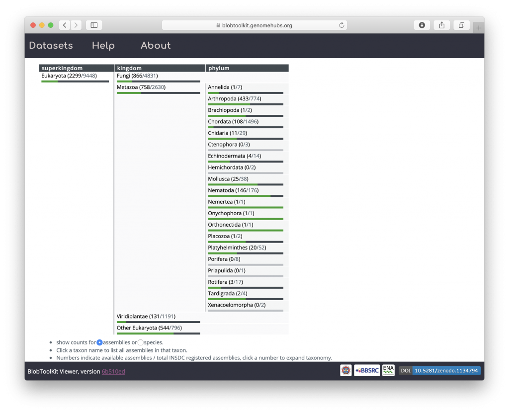

The BlobToolKit Pipeline is a configurable [Snakemake](https://snakemake.readthedocs.io/en/stable/) pipeline to run analyses on publicly available, International Nucleotide Sequence Database Collaboration ([INSDC](http://www.insdc.org)) registered eukaryotic genome assemblies. The Pipeline automates all steps in the generation of [BlobDir](https://blobtoolkit.genomehubs.org/specification/) datasets, including retrieval/formatting of public database files, retrieval of assembly-specific sequences and read files, read mapping, BLAST/Diamond searches and BUSCO analyses.

The Pipeline is also suitable for running on local assemblies. If files are available, the `fetch_assembly` and `fetch_fastq` steps can be omitted and the remainder of the Pipeline will use these local files (see _[Pipeline Tutorials](https://blobtoolkit.genomehubs.org/pipeline/pipeline-tutorials/)_ for more details).

The datasets we have analysed using the Pipeline are available on a public instance of the [BlobToolKit Viewer](https://blobtoolkit.genomehubs.org/btk-viewer/) at [blobtoolkit.genomehubs.org/view](https://blobtoolkit.genomehubs.org/view). This public Viewer instance includes a browsable summary of progress towards our goal of analysing all public assemblies, which is updated as we add new datasets and as the set of publicly available datasets continues to grow.

See the _[Pipeline Tutorials](https://blobtoolkit.genomehubs.org/pipeline/pipeline-tutorials/)_ for more information on how to analyse assemblies using the Pipeline or check out our [open-source code](https://github.com/blobtoolkit/insdc-pipeline) on GitHub.
