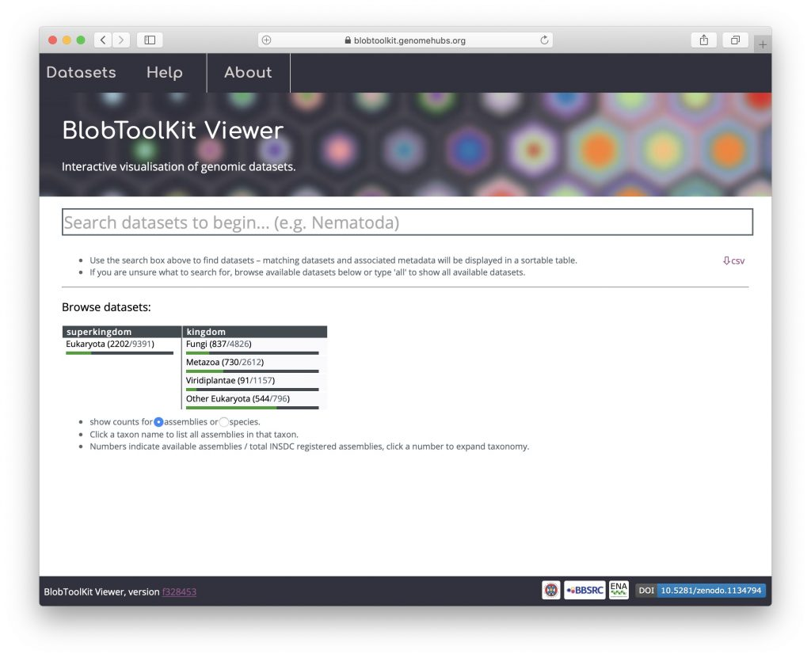
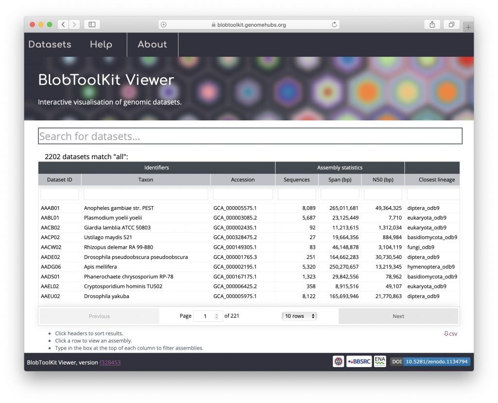
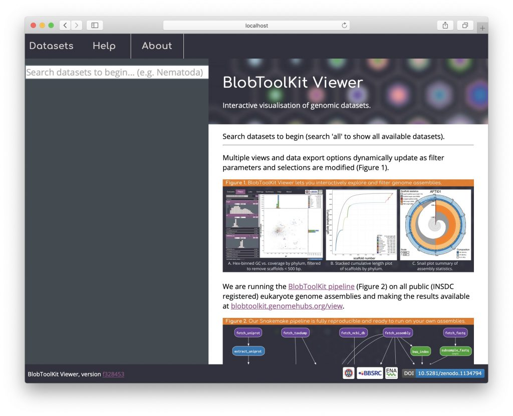
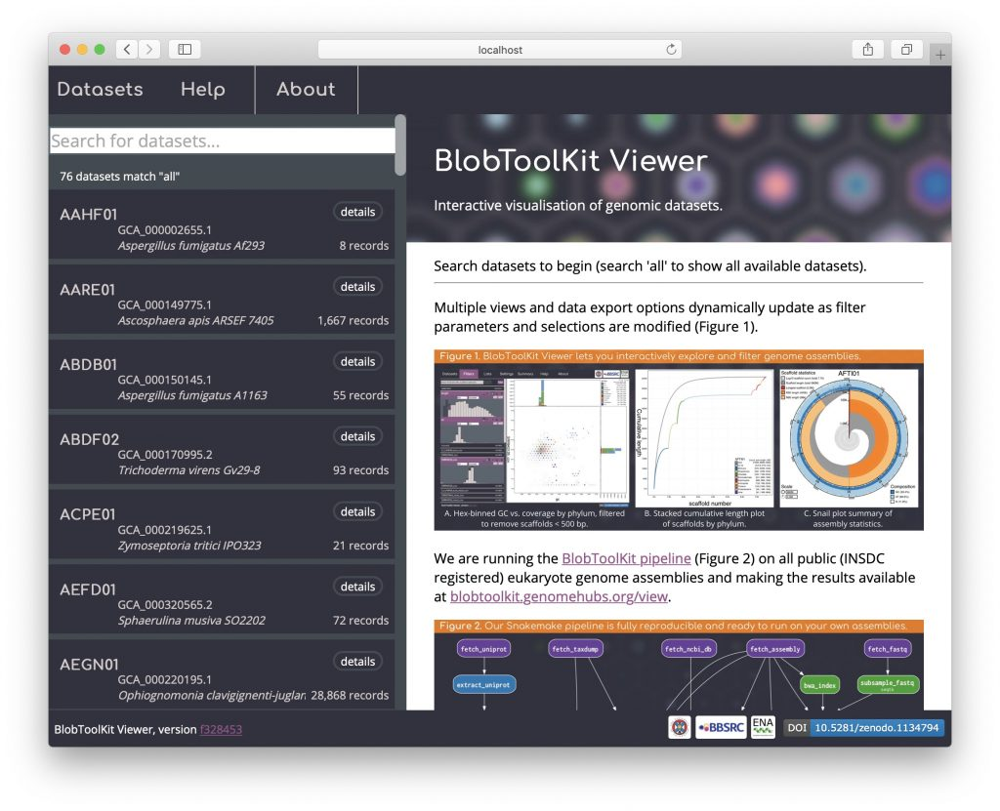

We host a public instance of the Viewer at [blobtoolkit.genomehubs.org/view](https://blobtoolkit.genomehubs.org/view) where you can explore our analyses of thousands of publicly available datasets. If you want to use the Viewer on your own data then you will need to host a local instance (see _Hosting a local instance_).

Both public and local instances share almost all features in common, allowing you to use the same set of tools on local assemblies as are available for exploring the public datasets at at [blobtoolkit.genomehubs.org/view](https://blobtoolkit.genomehubs.org/view). The most obvious differences are in the default home page appearance where the public instance has some features that rely on pre-computed summary statistics.

#### Public home page

The public Viewer instance home page includes a set of taxonomic progress bars indicating progress towards running the [BlobToolKit pipeline](https://blobtoolkit.genomehubs.org/pipeline/) on all [INSDC](http://www.insdc.org)\-registered assemblies:

Public instance search results (see _Searching available datasets_) are displayed in a table of summary statistics pre-computed using the Command Line Interface to the Viewer (see _Using the Command Line Interface_). This table can be customised to add/remove columns of identifiers, assembly statistics, BUSCO scores, taxonomy, summary statistics and read coverage. The table can be sorted or filtered based on the values in any column and may be exported as a CSV format file by clicking the "csv" button under the right-hand end of the table:

#### Local home page

The default local instance home page has a search bar on the left-hand side. This default can be altered to match the public instance by setting appropriate environment variables (see _Hosting a local instance_ for more details):

Search results are displayed as a simple list with only basic metadata, including the dataset ID, GCA accession, taxon name and number of records:

