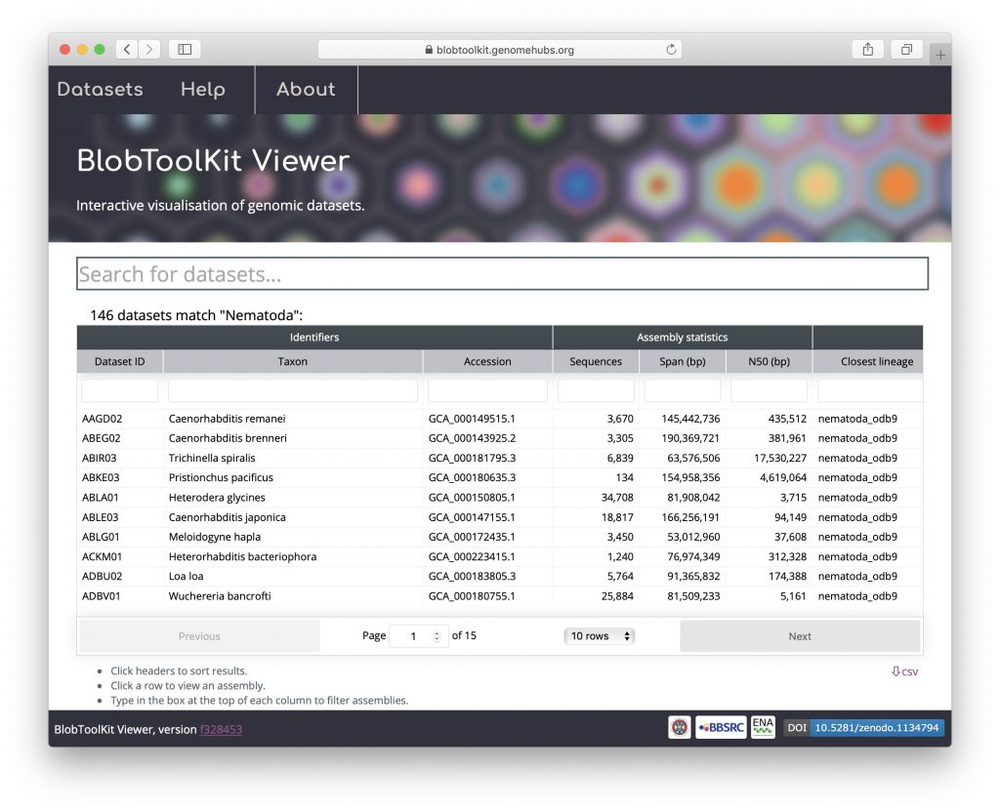
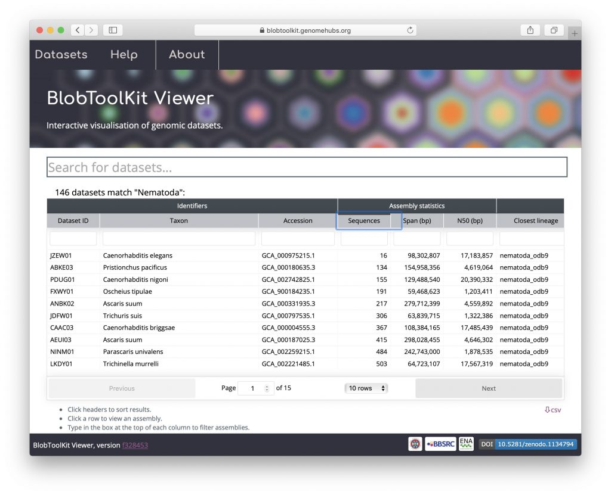
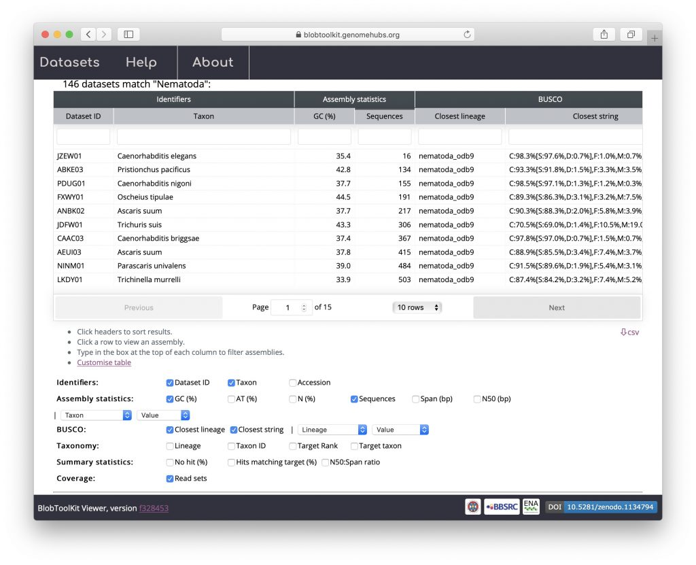
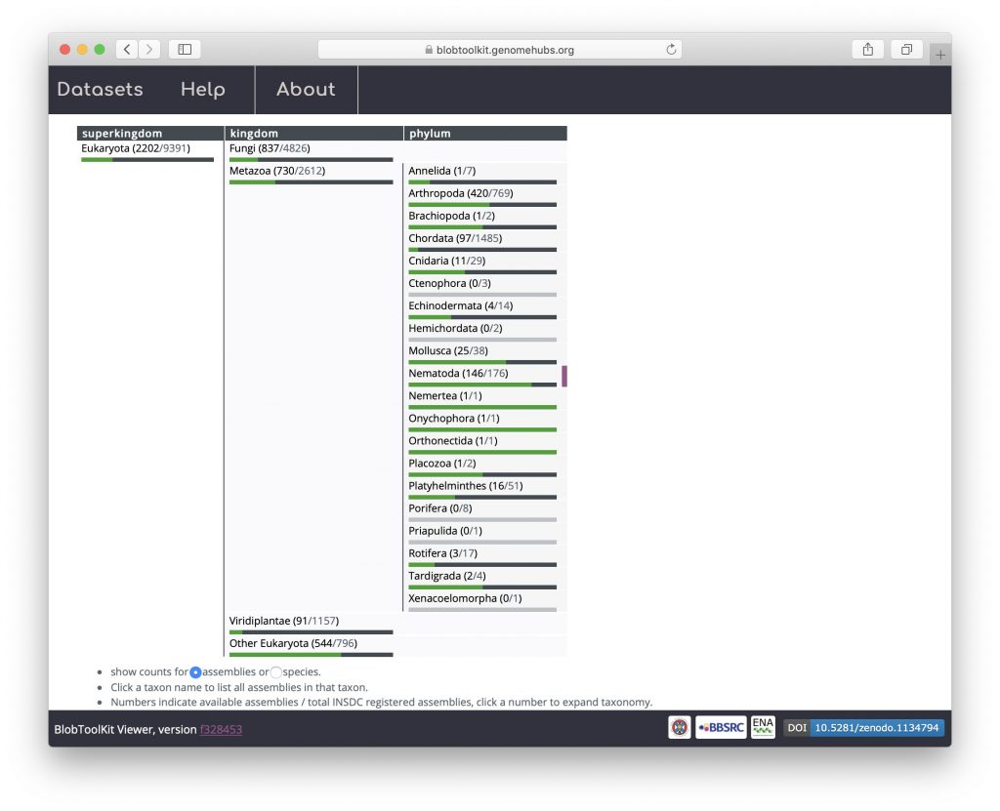
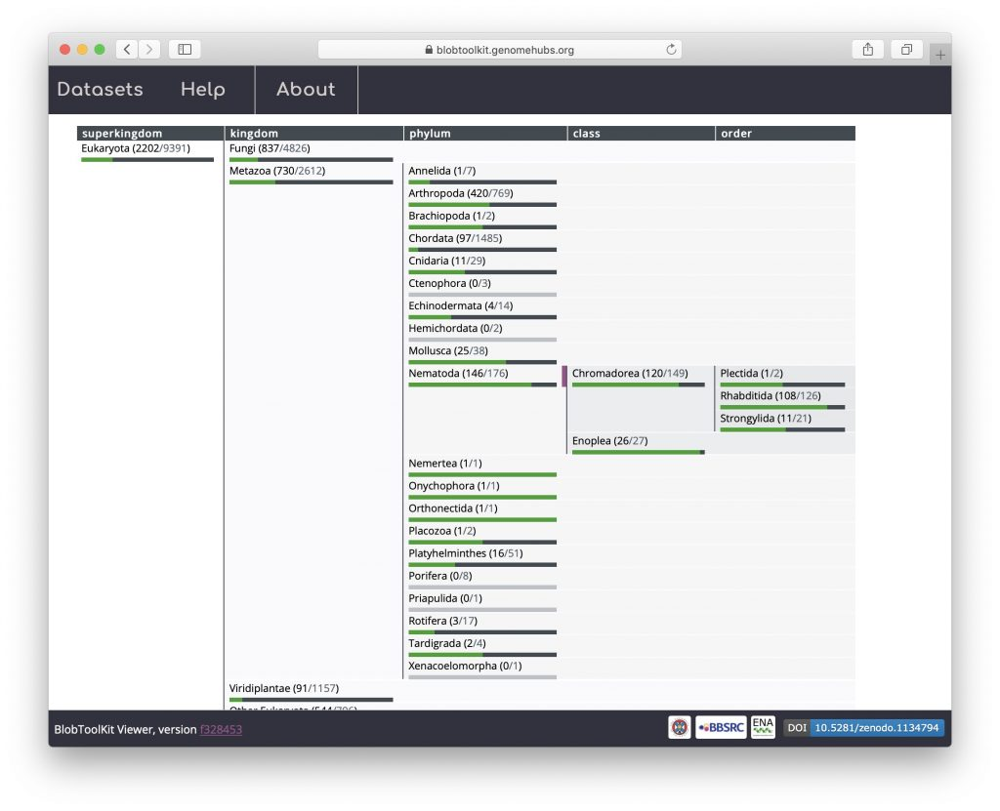
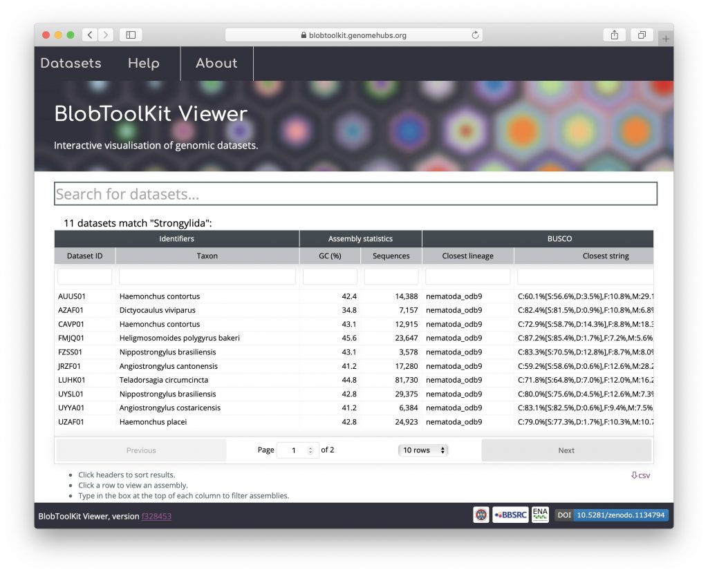

There are two ways to search for available datasets: (i) using the search box to search by dataset id or any term in the dataset metadata, e.g. phylum or assembly accession; or (ii) browsing the NCBI taxonomy to find datasets by taxonomic group in the public instance. The public viewer instance is available at [blobtoolkit.genomehubs.org/view](https://blobtoolkit.genomehubs.org/view).

#### Using the search box

Type any search term into the search box at the top of the page. Autocomplete suggestions will appear as you type based on information in the metadata for each available dataset. Here searching for "Nematoda" brings up the following suggestions for "Ne":

Either finish typing your search term and press enter, or select one of the autocomplete suggestions to see a list of matching datasets. Note that the table view shown below is not available by default for a local instance as it depends on pre-computed summary statistics (see [_Public vs. local instances_](https://blobtoolkit.genomehubs.org/btk-viewer/viewer-tutorials/public-vs-local-instances/)):

Click on any row in the table to view that dataset (see _Exploring different plot types_). The table can be sorted by clicking on any column header. To order assemblies by the number of sequences, for example, click on the "sequences" header:

Click the "Customise table" link to choose additional columns to display or hide default columns. The data can be downloaded as a CSV format file by clicking the "csv" link below the table:

Scroll down below the table to see that the taxonomy browser has been automatically expanded to the rank that most closely matches your search term (with the matching taxon indicated by a vertical pink bar):

#### Using the taxonomy browser

The taxonomy browser provides an alternative way to find datasets. At each of eight common shared ranks (superkingdom, kingdom, phylum, class, order, family, genus and species), taxa for which an [INSDC](http://www.insdc.org)\-registered assembly is publicly available are represented by a progress bar. The data on available assemblies are updated weekly by querying the [ENA](https://www.ebi.ac.uk/ena) API. Taxa for which a BlobToolKit analysis has been completed are indicated by a green progress bar showing how many datasets are available on the public instance of the viewer. Light grey progress bars indicate taxa that are not yet represented by any of the datasets in the public Viewer instance. These data are also shown numerically in parentheses after each taxon name. To browse available datasets, click the numbers inside the parentheses to expand and collapse nodes in the hierarchy:

Click a taxon name to search for all matching datasets:

