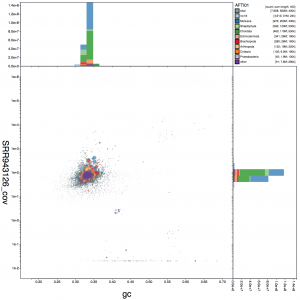

### Viewer

BlobToolKit allows interactive filtering and visualisation of genome assemblies [blobtoolkit.genomehubs.org/view/](https://blobtoolkit.genomehubs.org/view/).

### BlobTools

BlobToolKit uses Dom Laetsch's [BlobTools](https://github.com/DRL/blobtools).

### Source code

BlobToolKit source code, including the [Snakemake](https://snakemake.readthedocs.io/en/stable/) pipeline used to process INSDC assemblies for the viewer, is being openly developed on [Github](https://github.com/blobtoolkit).
