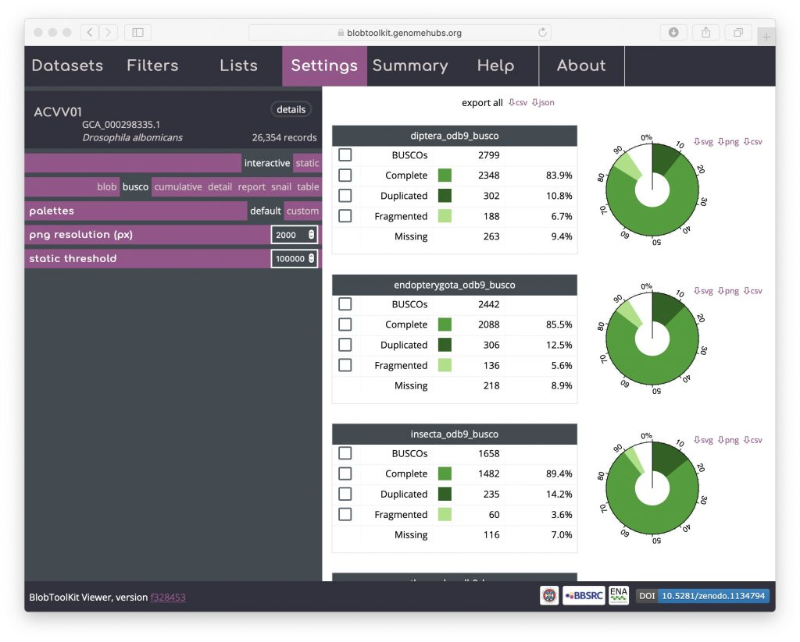
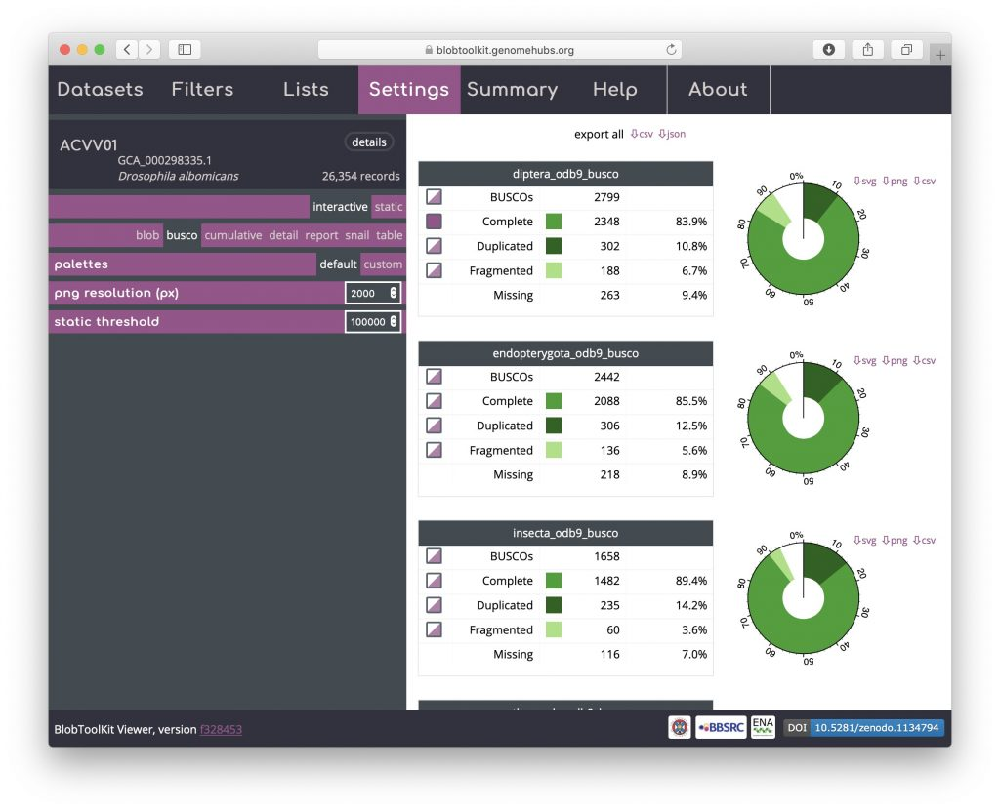
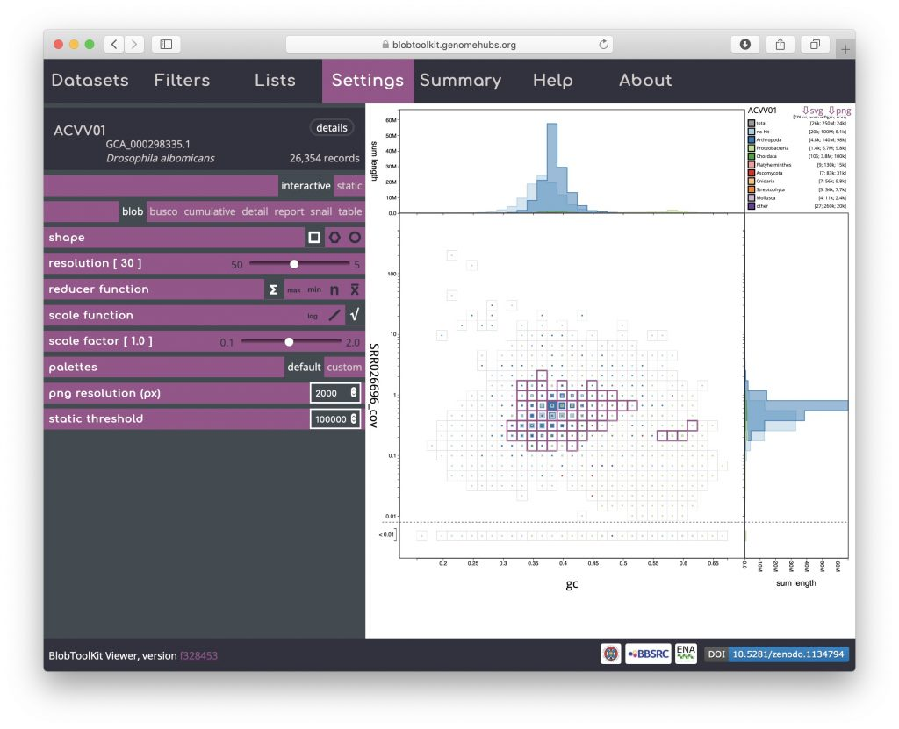
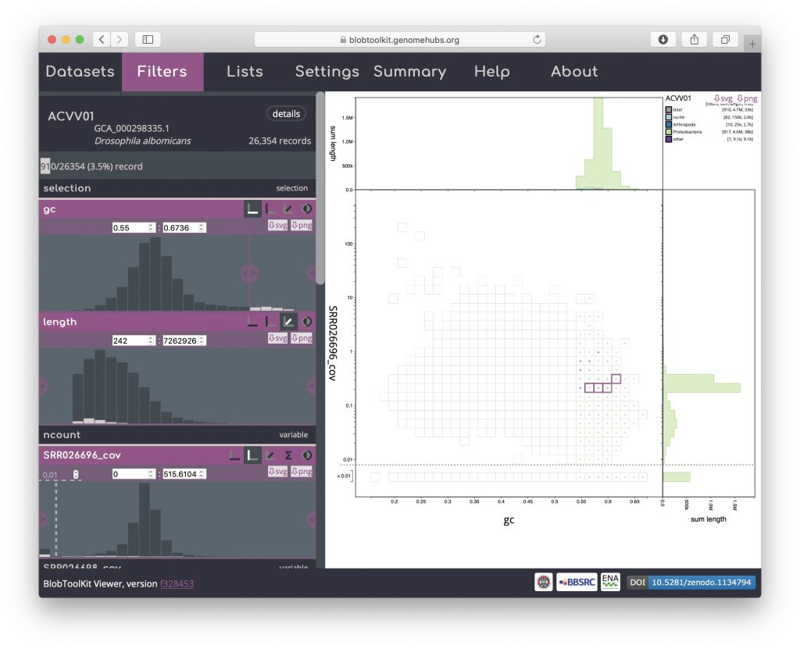
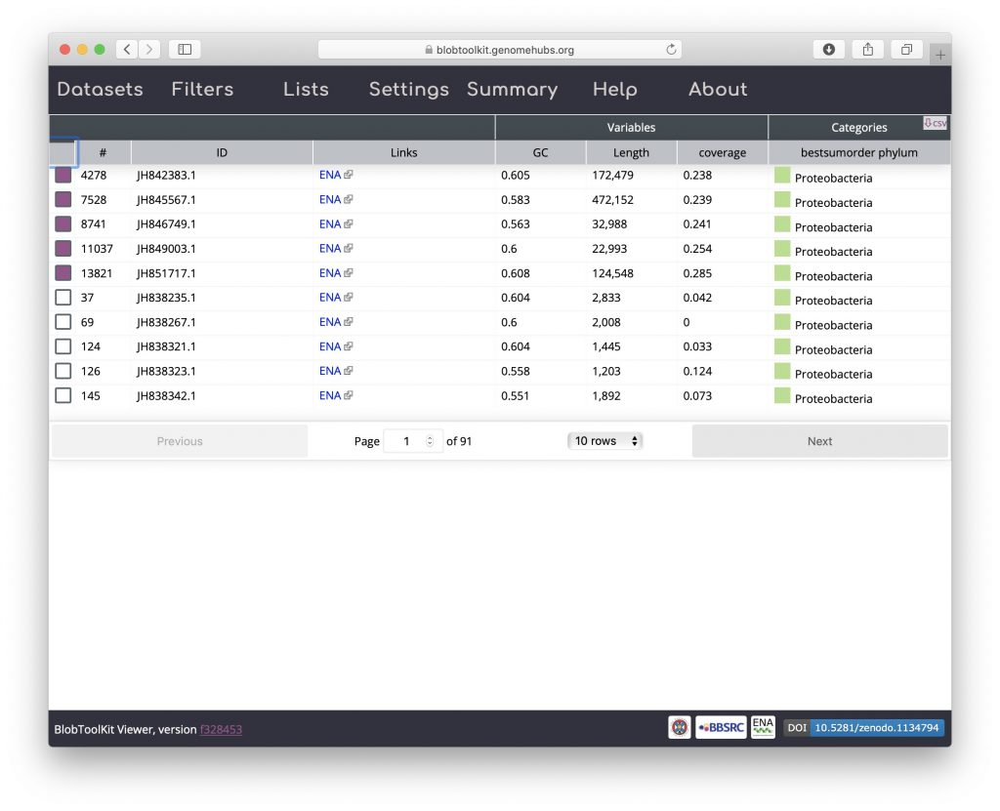
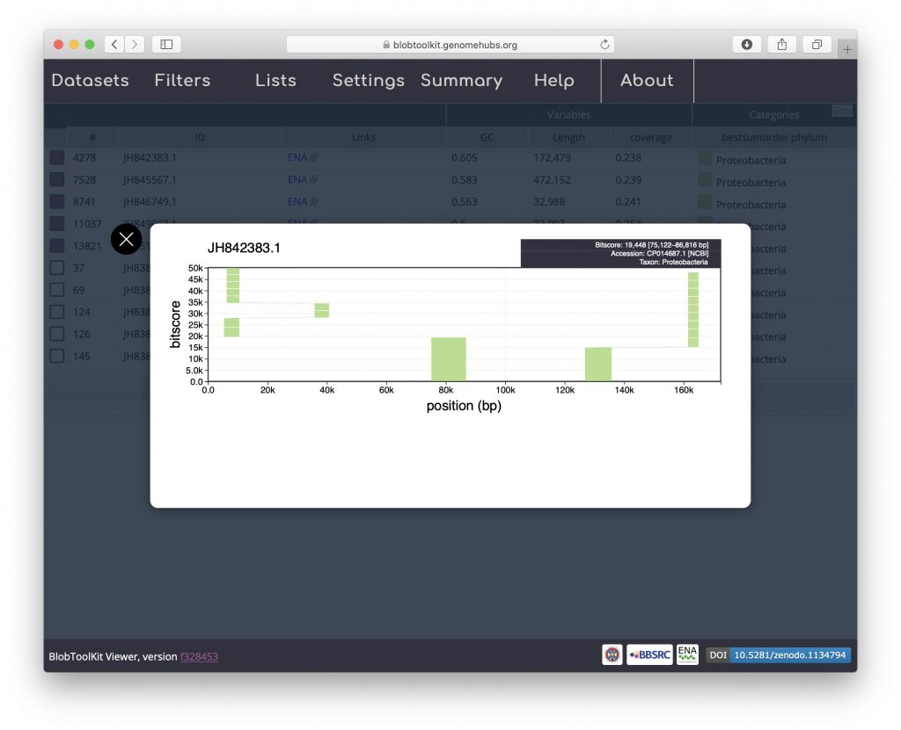

In addition to providing a mechanism for [Filtering assemblies](https://blobtoolkit.genomehubs.org/btk-viewer/viewer-tutorials/filtering-assemblies/) to extract or exclude features observed in blob plots, selections can be used to explore datasets by tracking specific scaffolds between views.

Selections can be made in _blob_ view, _BUSCO_ view or _table_ view (see [Exploring views](https://blobtoolkit.genomehubs.org/btk-viewer/viewer-tutorials/exploring-views/)). To open the _BUSCO_ view, click on the "Settings" tab and select "busco" in the _Settings_ menu:

Select all scaffolds that have a complete BUSCO gene in the _diptera\_odb9_ set by clicking the checkbox to the left of the word "Complete" in the top table of BUSCO results. Other checkboxes will be half-filled, showing that the selection includes a subset of scaffolds in these categories as well:

Click on the "Summary" tab to see a summary of the portion of the genome included in this selection. The values for the selected scaffolds (highlighted in pink) show that the selection includes around 35% of the total assembly with over 60% of the assembly span assigned to the phylum Arthropoda, but only 3.7% of the total number of scaffolds:

To see the distribution of these scaffolds on the _blob_ plot, select "blob" in the settings menu. Here a number of bins have a pink outline showing that some of the scaffolds in that bin have been selected. Most of these bins are clustered around the peak of scaffolds assigned to Arthropoda, however four bins have somewhat higher GC and form a separate cluster:

To investigate these further, open the _Filters_ menu and set the minimum GC value to 0.55 (see _[Filtering assemblies](https://blobtoolkit.genomehubs.org/btk-viewer/viewer-tutorials/filtering-assemblies/)_):

Then return to the _Settings_ menu and select the _table_ view:

Click on the table header above the checkboxes in the left-hand column to sort selected scaffolds to the top of the list:

All of the selected scaffolds are labelled Proteobacteria suggesting that these BUSCO genes are present in a _Wolbachia_ endosymbiont of _Drosophila albomicans_. Click on one of the coloured squares in the _Categories_ column to see the distribution of BLAST hits that the taxonomic assignment is based on and for links to gene records in the NCBI database:

