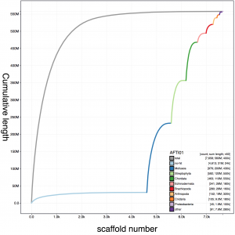
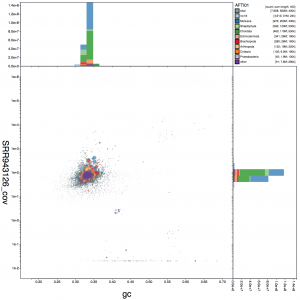
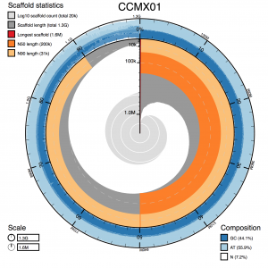
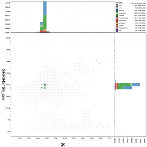

Visualise assemblies using the new BlobToolKit viewer ([blobtoolkit.genomehubs.org/view/](https://blobtoolkit.genomehubs.org/view/), [github.com/blobtoolkit/viewer](https://github.com/blobtoolkit/viewer)):

  

  

  

Example using data obtained from [ENA](https://www.ebi.ac.uk/ena) for the Pacific oyster _Crassostrea gigas_ ([AFTI01](https://www.ebi.ac.uk/ena/data/view/AFTI01000000)). Processed using a BlobToolKit [Snakemake](https://snakemake.readthedocs.io/en/stable/) pipeline available at [github.com/blobtoolkit/insdc-pipeline](https://github.com/blobtoolkit/insdc-pipeline).
